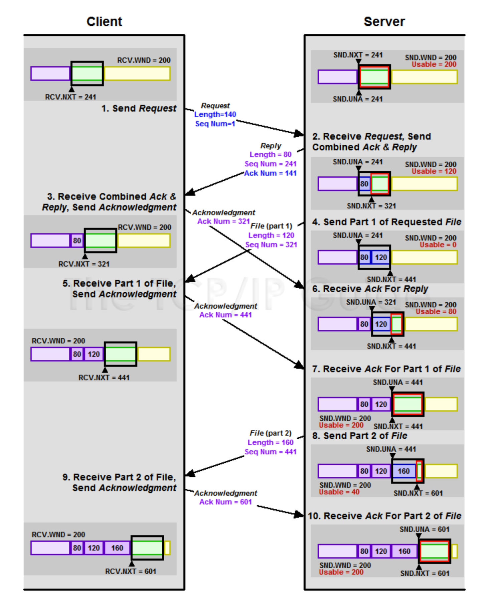

TCP 흐름제어 및 혼잡제어(폭주제어)

- 흐름제어 
  - client와 server간 sliding window가 진행되는 과정
    - window size 란 ACK를 기다리지않고 전송가능한 데이터의크기를 이야기함
    - 기본적으로 윈도우는 송신(폭주)윈도우와 수신윈도우가 있는데, 송신윈도우와 수신윈도우중 작은 쪽을 송신윈도우로 채택한다.
    - 이런 윈도우는 응답을 주고 받으며 이동해가는데, 이렇게 이동해 가능 방식을 sliding window라고 부른다
    - 
      - [출처](http://www.tcpipguide.com/free/t_TCPSlidingWindowDataTransferandAcknowledgementMech-5.htm)
      - client쪽의 바(bar)는 Rcv Buffer, server쪽의 바(bar)는 Sen Buffer
      - TCP 연결이 이루어질 때, 초기에는 수신자(Receiver)와 송신자(Sender) 간의 윈도우 크기를 동기화함. 이를 "TCP의 윈도우 스케일링(Window Scaling)"이라고 한다
        - 그래서 RCV.WND와 SND.WND가 동일
        - 이후에는 각 호스트는 TCP 흐름 제어 알고리즘을 통해 윈도우 크기를 동적으로 조절하게 되고, 수신자의 윈도우 크기는 ACK 패킷에 의해 송신자에게 통지.
      - 용어정리
        - SND.UNA
          - TCP 송신자(Sender)가 보낸 데이터 중 아직 확인 응답(Acknowledgement)을 받지 못한 가장 최근의 시퀀스 번호
          - SND.UNA는 TCP의 흐름 제어와 재전송 메커니즘에서 중요한 역할. 수신자가 SND.UNA보다 작은 시퀀스 번호의 확인 응답을 송신자에게 반환하면, 송신자는 해당 시퀀스 번호 이전의 데이터를 재전송
        - SND.NXT
          - TCP 송신자(Sender)가 보낼 데이터 SEQ
          - 연결된 TCP 수신자(Receiver) RCV.NXT와 동기화
        - SND.WND
          - 송신 윈도우
          - client <-> server 간 TCP의 윈도우 스케일링을 통해 결정된 윈도우 사이즈
          - RCV.WND와 동일
        - RCV.WND
          - 수신 윈도우
          - client <-> server 간 TCP의 윈도우 스케일링을 통해 결정된 윈도우 사이즈
          - SND.WND와 동일
        - RCV.NXT
          - TCP 수신자(Receiver)가 받게될 데이터 SEQ
      - 송수신과정(Client Send pointer / Server Receive pointer)
          1. set up
             - RCV.WND 와 SND.WND 동기화 (200)
             - SEQ 동기화 
               - Client의 RCV.NXT = 241
               - Server의 SND.NXT = 241
             - Client의 SND.UNA은 SND.NXT 는 모두 1로 같은 값인데, 이는 아직 데이터를 보내지않았고, ack도 받을게 없기때문
          2. Send Request ( Client )
             - 140 bytes 전송.
             - 보내는 Seq Num는 1
             - Client의 SND.NXT 포인터는 이제 141로 증가되고, SND.UNA 포인터는 아직 보낸 데이터의 응답을 받지 못했으므로 1로 유지
             - 참고로.. Client의 SND.WND는 360이라면, 송신 윈도우는 220Bytes( SND.UNA + SND.WND - SND.NXT) 이기에 ACK없이 바로 보낼수있는 데이터가 220Bytes다
          3. Receive Request, Send Combined Ack & Reply ( Server )
             - 응답으로 80바이트 전송
             - 보내는 첫 포인터는 241이기에 Seq NUM = 241로 전송
             - client가 보낸 140바이트를 받은것에 대한 응답으로 Ack Num = 141로 응답
             - 이때 Server의 사용가능한 송신 윈도우 120바이트인데, 총 200바이트에서 80바이트를 전송하고 아직 응답을 받지못했기때문
               - 80바이트에 대한 응답을 아직 못받았으므로 SND.UNA = 241
               - 80바이트를 전송했으므로 SND.NXT = 321
          4. Receive Combined Ack & Reply, Send Acknowledgement ( Client )
             - 서버에서 ACK NUM 을 141로 응답해주었기에, SND.UNA = 141
             - 그리고 이때에, Client의 SND.WDN 이 140만큼 추가로 슬라이딩되어 다시 360바이트 보낼수있게됨
               - **이 부분이 ACK 응답을 기다릴 필요 없음으로, 높은 처리량을 보장하는 TCP 기능의 핵심요소** 
          5. Send Part 1 of Requested File( Server )
             - client의 요청으로 총 280바이트의 파일을 보내기시작
             - 아직 80바이트에 대한 응답은 없지만, 사용가능한 SND.WND가 120남아 있기에 120 바이트 전송
               - 여전히 client로부터 받은 응답은 없기에 SND.UNA = 241
               - 120바이트를 추가로 전송했으니 SND.NXT = 441
               - **이 부분이 ACK 응답을 기다릴 필요 없음으로, 높은 처리량을 보장하는 TCP 기능의 핵심요소**
          6. Receive Part 1 of File, Send Acknowledgement ( Client )
             - 서버로 부터 120바이트 받은것에 대한 응답 보내줌 ACK NUM = 441
          7. Receive Ack For Reply( Server)
             - 클라이언트로부터 전송한 80바이트에 대한 잘 받았다는 응답을 받음
               - 80바이트 전송한것에 대한 응답을 받았기에 SND.UNA = 321
             - 클라이언트의 응답에 따라 SND.WND가 슬라이딩되어, 사용가능한 윈도우는 80 바이트로.. (321 + 200 - 441)
             - 사용가능한 윈도우가 80바이트가 되어 데이터를 전송할 수 있긴하지만, 너무 작은 세그먼트를 보내면 성능문제 유발 가능하기에, 100바이트 미만의 세그먼트는 보내지 않도록 가정. 그래서 서버는 기다림
          8. Receive Ack For Part 1 of File
             - 클라이언트로부터 전송한 120바이트에 대해 잘 받았다는 응답 받음
               - 120바이트 전송한것에 대한 응답을 받았기에 SND.UNA = 441
             - 클라이언트의 응답에 따라 SND.WND가 슬라이딩되어, 사용가능한 윈도우는 200바이트로.. (441 + 200 - 441)
          9. Send Part 2 of File
             - 나머지 파일의 160바이트를 클라이언트에게로 전송
             - 이때 Server의 사용가능한 송신 윈도우 40바이트인데, 총 200바이트에서 160바이트를 전송하고 아직 응답을 받지못했기때문
               - 160바이트에 대한 응답을 아직 못받았으므로 SND.UNA = 441
               - 160바이트를 전송했으므로 SND.NXT = 601
          10. Receive Part 2 of File, Send Acknowledgement
             - 서버로 부터 160 바이트 받은것에 대한 응답 보내줌 ACK NUM = 601
          11. Receive Ack For Part 2 of File
             - 클라이언트로부터 전송한 160바이트에 대해 잘 받았다는 응답 받음
               - 160바이트 전송한것에 대한 응답을 받았기에 SND.UNA = 601
             - 클라이언트의 응답에 따라 SND.WND가 슬라이딩되어, 사용가능한 윈도우는 200바이트로.. (601 + 200 - 601)

- 기타
  - `ss` 명령어를 통해서 수신측이 느리게 받고 있는지, 송신측이 느리게 받고 있는지 알 수 있다
    - "기타 네트워크 정리.md" 참고

---

- 혼잡제어(폭주제어)

---

- 참고사이트
  - [TCP관련 내용 매우잘 정리되어있음](http://www.tcpipguide.com/free/t_TCPSlidingWindowDataTransferandAcknowledgementMech-5.htm)
  - [간단하게 잘 정리되어있음](https://velog.io/@jihwankim94/Network-TCP-3-ways-handshake-%EB%B6%80%ED%84%B0-%ED%9D%90%EB%A6%84%ED%98%BC%EC%9E%A1-%EC%A0%9C%EC%96%B4-%EA%B9%8C%EC%A7%80)
  - [혼잡제어 정리](https://evan-moon.github.io/2019/11/26/tcp-congestion-control/)
  - [혼잡제어 정리2](https://ai-com.tistory.com/entry/%EB%84%A4%ED%8A%B8%EC%9B%8C%ED%81%AC-TCP-Congestion-Control-1-%EA%B8%B0%EB%B3%B8-%EC%9B%90%EB%A6%AC)
  - [혼잡제어 정리3](https://ai-com.tistory.com/entry/TCP-Flow-control-Congestion-control)