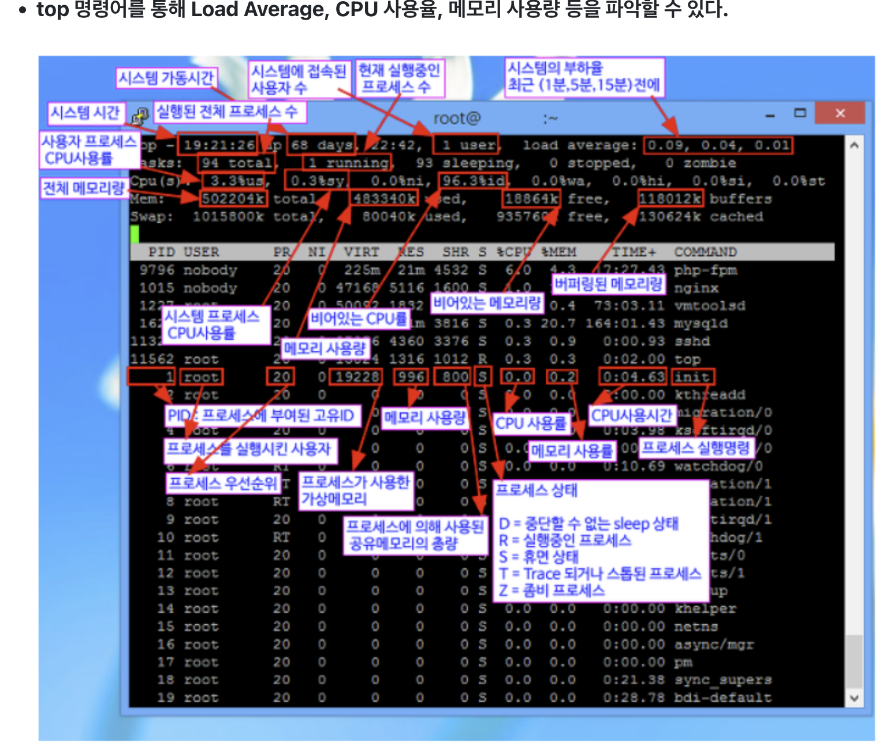

기타 네트워크관련 정리
- [timewait 및 소켓 관련 내용 굿](https://docs.likejazz.com/time-wait/#:~:text=TIME_WAIT%20%EC%83%81%ED%83%9C%EA%B0%80%20%EC%99%9C%20%ED%95%84%EC%9A%94,%ED%95%B4%20%EB%AC%B8%EC%A0%9C%EA%B0%80%20%EB%B0%9C%EC%83%9D%ED%95%9C%EB%8B%A4.)
  - SO_REUSEADDR
    - 서버가 active_close를 하여, Time_wait인 상태에서 서버를 재시작하려할때 해당 소켓이 Time_wait인 상태이기에 `Address already in use` 가 나타난다
    - 그래서 즉시 시작을 하기위해서는 해당 옵션을 적용하여야한다.. (bind단계에서 커널이 가져간 소유권을 돌려받을수있다)
    - `tcp_tw_reuse` 와는 다른개념이다..! 
      - 이는 서버가 아닌 클라이언트에 적용되는 개념
    - 자바에서 서버소켓 ReuseAddress 셋팅시 주의사항
      - [자바사용시 주의사항](./java_serverSocket_reuseAddress.png)
  - timestamp (net.ipv4.tcp_timestamps)
    - 재사용을 위해서는 서버와 클라이언트가 해당 옵션이 반드시 켜져잇어야한다
    - `net.ipv4.tcp_tw_reuse`를 활성화하면, 새로운 타임스탬프가 기존 커넥션의 가장 최근 타임스탬프보다도 큰 경우 TIME_WAIT 상태인 커넥션을 재사용
    - 서버가 LAST_ACK 상태에서 클라로 부터 ACK을 받지 못한 상태에서 새로운 커넥션이 SYN을 보내면 타임스탬프를 비교해 무시한다.(기존에는 SYN 받으면 RST를 보내서 연결 자체가 안됨..) 그러는 사이 서버의 FIN이 재전송된다. 그러면 SYN_SENT 상태에 있던 클라이언트는 RST를 보낸다. 이제 서버가 LAST_ACK 상태를 빠져나온다. 그러는 사이 ACK을 받지 못한 클라이언트는 1초 후 다시 SYN을 전송한다. 이제 서버도 SYN+ACK을 보낸다. 이제 둘은 정상적으로 ESTABLISHED 된다.
  - FIN_WAIT1 과 FIN_WAIT2
    - FIN_WAIT1은 FIN_WAIT2와 다른 상태다. FIN을 보내주길 하염없이 기다리기만 하는 FIN_WAIT2와 달리 FIN_WAIT1은 우리가 보낸 최초 FIN에 대해 아직 ACK 응답이 도달하지 않은 상태로, 일반적으로 상대방 OS에 문제가 있는 경우로 간주할 수 있다. 왜냐면 최초 ACK 응답은 OS가 리눅스라면 커널이, 윈도우라면 시스템이 바로 보내야 하는 패킷이기 때문이다.
    - ACK을 수신하지 못할 경우 결국 소켓은 종료된다
    - 또한 기다리기만 하는게 아니라 지속적으로 FIN을 재시도한다. 첫 패킷에는 2초, 그 다음 부터는 5초, 10초. 대기시간을 늘려가며, 따로 커널 설정을 변경하지 않은 서버에서 최대 8번까지 재시도 하는 것을 확인할 수 있었다.

  - 커널 헤더에 TIME_WAIT은 TCP_TIMEWAIT_LEN 이라는 상수로 60초 하드 코딩 되어 있으며 변경할 수 없다.
  - 서버가 할당하는 것은 포트가 아닌 소켓이며 서버의 포트는 최초 bind()시 하나만 사용한다. 로컬 포트를 할당하는 것은 클라이언트이며, 클라이언트가 connect()시 로컬 포트를 임의로(ephemeral port) 바인딩하면서 서버의 소켓과 연결된다.
  - 소켓은 `<protocol>`,`<src addr>`, `<src port>`, `<dest addr>`, `<dest port>` 이 5개 값이 유니크하게 구성된다. 따라서 서버 포트가 추가되거나 클라이언트의 IP가 추가될 경우 그 만큼의 새로운 쌍을 생성할 수 있어 TIME_WAIT가 많이 남아 있어도 별 문제가 없다.
    - 로컬 포트가 고갈되었어도, 상대방 포트가 다르다면, 동일한 로컬 포트를 함께 쓰는게 가능하다. 같은 원리로 서버도 하나의 포트에 여러개의 소켓이 할당된다.
  - 소켓의 수는 설정된 리눅스 파일 디스크립터만큼 생성할 수 있다
  
----

- connection timeout vs socket timeout 
  - A connection timeout is the maximum amount of time that the program is willing to wait to setup a connection to another process. You aren't getting or posting any application data at this point, just establishing the connection, itself.
  - A socket timeout is the timeout when waiting for individual packets. It's a common misconception that a socket timeout is the timeout to receive the full response. So if you have a socket timeout of 1 second, and a response comprised of 3 IP packets, where each response packet takes 0.9 seconds to arrive, for a total response time of 2.7 seconds, then there will be no timeout.
  - https://stackoverflow.com/questions/7360520/connectiontimeout-versus-sockettimeout
- read timeout
  - 커넥션은 정상적으로 맺어졌지만, 클라이언트가 요청 후 일정시간동안 서버로부터 응답이 없을떄 나타나는 타임아웃

- [여기도 참고하기 괜춘](https://tyrionlife.tistory.com/790)
- [타임아웃 시간은 어느정도가 적절한지..](https://alden-kang.tistory.com/20#:~:text=%EA%B3%A0%EB%A0%A4%ED%95%B4%20%EB%B3%BC%20%EC%88%98%20%EC%9E%88%EB%8A%94%20%EA%B2%BD%EC%9A%B0,%EC%9D%B4%20%EC%9C%A0%EC%8B%A4%20%EB%90%98%EC%97%88%EC%9D%84%20%EB%95%8C%20%EC%9E%85%EB%8B%88%EB%8B%A4.)

----
- ServerSocket 
  - 초기순서
    1. 소켓생성
    2. bind
       - 어떤 포트로 열것인지 셋팅(소켓주소 할당)
    3. listen
       - 연결요청 대기상태
       - 이때부터 client는 connect 가능
       - 연결요청대기큐(back log) 생성
    4. accept
       - 연결요청 대기큐에 들어가있는 연결요청들을 accept에서 가져가는것
       - 여기서 클라이언트와 통신할 소켓이 만들어짐
         - `Socket s = serverSocket.accept();`
       - 그럼 언제 3 way handshake를 하기시작하나?
           - listen이 호출되는 시점부터 connect가 가능하게된다는 말은 TCP stack에서 3 way handshake를 한다고 보면된다..
           - 그리고 또한 listen 호출때 만들어진 큐(backlog)에 3 way handshake 된 커넥션이 쌓이고, 이를 accept함수를 통해서 가져가서 소켓을 만든다!
           - 큐가 가득 차게되면, 더 이상의 핸드쉐이크는 진행하지않는다
           - [출처](https://stackoverflow.com/questions/34676972/about-listen-accept-in-network-socket-programming3-way-handshaking)
             - Once the application has called listen(), the TCP stack will perform the 3-way handshake for any incoming connections. These connections are queued in the kernel, and accept() then retrieves the next connection from the queue and returns it.
             - There's a backlog argument to listen, and it specifies how large this queue should be (although I think some implementations ignore this, and use a limit built into the stack). When the queue is full, the stack will no longer perform the handshake for incoming connections; the clients should retry, and their connections will succeed when the queue has room for them.
             - It's done this way so that the client receives the SYN/ACK as quickly as possible in the normal case (when the backlog queue has room), so it doesn't have to retransmit the SYN.   
    5. client와 통신시작

---

- backlog
  - `net.core.netdev_max_backlog`
    - 물리적 네트워크 포트에서 패킷을 쌓아두는 커널의 큐 크기
    - 각 CPU 코어에 NIC으로부터 패킷이 들어올때, ring buffer라는 공간에 패킷을 모아놓는데 `net.core.netdev_max_backlog`을 통해서 큐에 저장할 수 있는 패킷의 수를 조절할 수 있음
    - `cat /proc/net/softnet_stat` 명령어를 통해서 손실된 패킷이 잇는지 확인가능
      - 첫번째 컬럼 : CPU가 처리한 패킷의 수
      - 두번째 컬럼 : 손실된 패킷의 수 (이게 0이 아니라면 `net.core.netdev_max_backlog`을 변경할 필요있음)
      - 세번째 컬럼: 실제 패킷을 처리할때 소모된 시간이 `net.core.netdev_budget` 값을 초과한 횟수 (주어진 시간동안 처리 못한 경우)
  - listen 함수의 backlog
    - 완전한 커넥션이 맺어진(즉, 3 way handshake가 완료된) 소켓이 accpet 되기를 기다리는 동안 대기하는 장소가 backlog queue이고 이 크기를 listen메소드에 인자값으로 넘겨줄수있다
      - `/proc/sys/net/core/somaxconn`에 지정한 값보다 인자값이 크게되면 무시됨. min(somaxconn, backlog)
        - `net.core.somaxconn`
          - accept()을 기다리는 ESTABLISHED 상태의 소켓(즉, connection completed)을 위한 queue (TCP 3-way-handshake 끝남)
    - 그러나, 커넥션이 완전히 맺어지지않은 소켓은 `/proc/sys/net/ipv4/tcp_max_syn_backlog` 에 지정한 값의 크기를 지닌 큐에 저장된다.
      - `syncookies` 활성화시키면 논리적으로 큐의 맥시멈 사이즈가 없다.. (무한정이라는뜻이겠지)
      - `net.ipv4.tcp_max_syn_backlog`
         - SYN_RECEIVED 상태의 소켓(즉, connection incompleted)을 위한 queue (아직 TCP 3-way handshake 안끝남)
           - 근데 Listen() 시스템 콜 호출 수 받게 되는 backlog, `somaxconn`, `syn_backlog`의 값들중 가장 작은 값 +1 을 했을때 올림해서 가까운 **2의 제곱수** 가 syn queue 사이즈가된다..
             - 예를들어, 
               - Listen() 시스템 콜 호출 수 받게 되는 backlog : 512
               - `net.core.somaxconn` : 700
               - `net.ipv4.tcp_max_syn_backlog` : 16000
               - 이렇게 되어있다면, 셋중 가장 작은 값이 512이고, 512에 1을 더한 513을 올림하여 가까운 2의 제곱수는 1024이므로 syn backlog queue는 1024가 된다..
               - => 근데.. 이거 좀 이상함.. ss로 확인해봣을때 1000 으로 확인되는것도 있다.. 아래 두개 확인필요
                 - ss명령어의 send-q는 syn backlog queue를 말하는건가?
                   - => no! send-q는 accept queue 사이즈를 말한다
                 - accept queue size는 listen함수 호출시 전달해주는 BACKlog 값과 somaxconn과 비교해서 최소인걸 선택하나?
                   - => ok
         - SYN 큐는 클라이언트에서 보낸 SYN 큐를 저장하기 위한 큐입니다. 또한 SYN+ACK 패킷을 보내고 ACK를 받지 못한 경우 SYN+ACK패킷 전송을 재시도하는 역할을 합니다. 리눅스의 변수값 중에서는 net.ipv4.tcp_synack_retries로 설정할 수 있습니다.
           - 서버가 SYN+ACK패킷을 보낸 후에 일정시간동안 ACK를 받지 못하면 다시 SYN+ACK 패킷을 보냅니다. 재시도할 때의 delay는 서버가 exponential backoff 알고리즘을 통해 설정합니다. 커널의 세팅 중에서는 net.ipv4.tcp_synack_retries 값이 영향을 주는데, 이 설정값의 기본값은 5입니다. 총 횟수가 5번이기 때문에 delay는 1초, 3초, 7초, 15초, 31초가 되고 총 63초가 지나면 타임아웃이 발생합니다. 다시 말하면 SYN을 받은 서버는 연결을 생성하고 SYN backlog 큐에 넣은다음 최대 63초동안이나 기다린다는 의미입니다. 
           - 이 때 SYN backlog 큐의 사이즈가 작으면 문제가 발생합니다. 기다리는 연결들로 큐가 금방 꽉차게 되고 1분 넘게 기다려서야 기존의 연결이 타임아웃이 나서 지워지기 때문에, 이후에 갑자기 대규모 트래픽이 발생하면 더이상 SYN backlog 큐에 자리가 없어서 장애가 발생하게 됩니다.
       - SYN Flooding 이 발생하면 여기 확인필요
    - [listen 공식 메뉴얼](https://man7.org/linux/man-pages/man2/listen.2.html)
        ```
            The behavior of the backlog argument on TCP sockets changed with
            Linux 2.2.  Now it specifies the queue length for completely
            established sockets waiting to be accepted, instead of the number
            of incomplete connection requests.  The maximum length of the
            queue for incomplete sockets can be set using
            /proc/sys/net/ipv4/tcp_max_syn_backlog.  When syncookies are
            enabled there is no logical maximum length and this setting is
            ignored.  See tcp(7) for more information.

            If the backlog argument is greater than the value in
            /proc/sys/net/core/somaxconn, then it is silently capped to that
            value.  Since Linux 5.4, the default in this file is 4096; in
            earlier kernels, the default value is 128.  In kernels before
            2.4.25, this limit was a hard coded value, SOMAXCONN, with the
            value 128.
        ```
  - [backlog 관련 매우 로우레벨 설명.. 아직 백퍼 이해안감..](https://stackoverflow.com/questions/63232891/confusion-about-syn-queue-and-accept-queue) 
    - 뭔가.. syn backlog queue는 실재하지않는것같은 뉘앙스..
  - [여기도 영어긴하지만.. 설명 좋음](https://www.alibabacloud.com/blog/tcp-syn-queue-and-accept-queue-overflow-explained_599203)
    - Accept queue가 가득차면, client가 마지막으로 ACK를 보낼때, 이를 버려버린다.. 그러나 클라이언트는 연결된줄 알고 계속 데이터보내지만, 서버는 아직 ACK를 받지못한상태이기떄문에 SYN,ACK를 다시보낸다..(Accept queue에 자리 날떄까지!)
    - [SYN Queue and Accept Queue](./syn_queue_and_accept_queue_with_3wh.png)
      - case1
        - Config
          - backlog: 1024, somaxconn: 1024, tcp_max_syn_backlog: 128
          - maximum length of syn queue: 256 (이건 계산이 필요한데, 위에 설명 참고)
          - tcp_syncookies: 0
        - 결과
          - syn queue는 96개만 받을수 있음. (SYN_RECV 상태가 96개)  
            - <span style="color:red">이거이해안감..</span>
      - case2
        - config
          - backlog: 1024, somaxconn: 128, tcp_max_syn_backlog: 512
          - maximum length of syn queue: 256 
          - tcp_syncookies: 0
        - 결과
          - maximum length of syn queue가 accept queue보다 클때, 실제 syn queue는 accept queue 사이즈를 넘으면 syn요청을 DROP 한다
          - 즉, syn queue는 128개만 받을수 있다 (SYN_RECV 상태가 128개)
      - case3
        - config
          - backlog: 1024, somaxconn: 128, tcp_max_syn_backlog: 512
          - maximum length of syn queue: 256 
          - tcp_syncookies: 1
        - 결과
          - 이론적으로는 tcp_syncookies가 1이기때문에 SYN를 Drop하지않는데, Case2와 동일하게 나타난다함
          - 다른조건 모두 동일하나,somaxconn를 5로변경했을때 syn queue는 5개까지 받음
      - case4
        - config
          - backlog: 1024, somaxconn: 256, tcp_max_syn_backlog: 128
          - maximum length of syn queue: 256 
          - tcp_syncookies: 1
        - 결과
          - syn queue는 256개만 받을수 있다 (SYN_RECV 상태가 256개)
      - 결론
        - tcp_max_syn_backlog가 아무리커도, somaxconn의 크기보다 syn queue size는 커질수없다..
        - 그렇다면 어떻게 connection timeout을 막을수있나? (Syn queue overflow or accept queue overflow 되었을때..)
          - 서버의 backlog 사이즈 설정을 늘린다 (accept queue 사이즈 증가)
            - somaxconn 사이즈도 늘려줘야한다.. somaxconn 사이즈보다 크면 의미없다..
          - tcp_max_syn_backlog 또한 적절히 늘려주자.
            - 하지만 이 또한 somaxconn 사이즈 크면 작으면 의미없다..
          - `net.ipv4.tcp_abort_on_overflow` 설정을 1로 두어서, accept queue에 쌓아두지말고 바로 RST를 응답하여 소켓을 끊어버리자
            - 0: If the accept queue is full, the Server side DROP ACK from the Client side.
            - 1: If the accept queue is full, the Server side sends an RST message to the Client side to terminate the TCP socket link 
    - Many blogs say that the maximum length of the SYN queue is specified by the /proc/sys/net/ipv4/tcp_max_syn_backlog parameter. In fact, only when the linux kernel version is earlier than 2.6.20, the SYN queue is equal to the size of the backlog.
      - 리눅스 커널 버전이 2.6.20 이전일 때만 SYN 큐는 백로그의 크기와 같다.
    
  - [backlog 설명 및 네트워크 커널 튜닝설명 굿 - 위 글은 거의 여기서 참고](https://brunch.co.kr/@jehovah/23)
  - [backlog 로우레벨 설명 굿인것 같은데.. 내용이 좀 틀리는것같음.. sync backlog queue 갯수 설명은 굿!](https://brunch.co.kr/@alden/6)
    - nginx에서 syn 백로그 늘리는 방법 설명나옴
    - [여기도 설명 괜춘](http://hesu.github.io/programming/network/2016/01/27/tcp_syn_flooding.html)
  - [tcp flooding과 이에대한 해결책 나옴](https://brunch.co.kr/@alden/5)
    - syncookies에 대한 Side effect..도 있음
  - [backlog 관련 코드예시까지 굿](https://velog.io/@techy-yunong/socket-programming-listen-API-backlog)
  

---
- TCP SYN Flooding
  - TCP SYN Flooding?
    - 여기서 SYN는 TCP 연결의 3-way-handshake 에서 사용하는 SYN 비트를 의미한다. 즉, 말 그대로 본다면 SYN가 넘쳐버린것이다.
    - 3-way-handshake 는 3단계로 나뉜다
      - 1. A(클라이언트)가 B(서버)에게 SYN 요청을보낸다. 이때 A는 SYN_SENT 상태가된다
      - 2. B는 A에게 SYN, ACK를 보낸다. 이때 B는 SYN_RECV 상태가되고, 이 메세지를 A가 받게되면 A는 established 상태가된다
        - 여기서 B는 A로 부터 받은 요청한 커넥션(아직 미완인 소켓)을 SYN backlog queue에 넣는다
      - 3. A는 B에게 ACK를 보낸다. 이 메세지를 B가 받게되면 B는 established 상태가된다
        - 여기서 B는 SYN backlog queue에 있는 미완의 소켓을 제거하고, 커넥션이 완료된 소켓을 backlog queue에 넣게된다
          - backlog queue의 사이즈는 서버소켓을 만들때 listen함수의 인자값으로 넘기게되는데, `net.core.somaxconn` 여기에 셋팅된 숫자보다 크면 무시하고 `net.core.somaxconn` 값을 사용하게된다
          - 참고로 여기 backlog queue에 있는 커넥션은 accpet 함수를 사용해서 사용하게된다 
    - 여기서 서버가 클라이언트로부터 ACK를 받지못하고, 다른 클라이언트들로부터 계속해서 SYN를 받게되면(이 또한 ACK를 받지못함), 더이상 어떤 SYN도 받지 못하는 서비스 거부상태가된다.
      - 받을 수 있는 크기는 `net.ipv4.tcp_max_syn_backlog` 여기서 결정된다.
        - 엄밀히는 `net.ipv4.tcp_max_syn_backlog` 값과 서버 생성시 backlog 셋팅값이 모두 사용
        - 그렇기때문에 `net.ipv4.tcp_max_syn_backlog`가 커도, nginx 같은경우는 sync backlog값이 511로 셋팅된다..


  - https://www.linux.co.kr/bbs/board.php?bo_table=lecture&wr_id=2622
  - [원인 설명 굿](https://www.linux.co.kr/bbs/board.php?bo_table=lecture&wr_id=2623)
  - https://www.linux.co.kr/bbs/board.php?bo_table=lecture&wr_id=2624
  - http://hesu.github.io/programming/network/2016/01/27/tcp_syn_flooding.html
  - https://brunch.co.kr/@alden/6

---

- loadAverage의 의미
  - running 상태의 (CPU 자원이 많이 필요하는) 프로세스의 수와 uninterruptible 상태의 (I/O 자원이 많이 필요하는) 프로세스의 수를 합한 값. 
  - 즉, CPU를 사용하자고 해도 다른 프로세스가 CPU를 사용하고 있어서 기다리고 있는 프로세스 와 디스크 입출력이 끝날때 까지 기다려야만 하는 프로세스 두가지로 나타내어지는 값이다.
  - Load Average 값은 CPU의 코어수에 따라서 숫자가 달라지며 각 CPU 코어가 100% Load가 발생할 경우, 1 코어는 값 1, 2코어는 값 2, 4코어는 값 4로 표현이 됩니다.
    - 시스템 운영시 권장하는 에버리지는 70%인 0.7 이하 이며 그 이상일 경우 시스템에 이상이 없는지 반드시 체크를 해야합니다.
    - 참고로 1코어에서 2라는 숫자가 나올 수도 있는데 이것의 의미는 100%는 로드된 상태 100%는 대기하는 상태를 뜻합니다.
    - https://kim-dragon.tistory.com/45#:~:text=Load%20Average%EB%9E%80%20%EC%96%BC%EB%A7%88%EB%82%98%20%EB%A7%8E%EC%9D%80,%ED%8F%89%EA%B7%A0%EB%82%B8%20%EA%B0%92%EC%9D%84%20%EB%A7%90%ED%95%A9%EB%8B%88%EB%8B%A4.
  - https://injae-kim.github.io/dev/2020/07/09/how-to-check-single-server-load-average.html
  - https://brunch.co.kr/@dreaminz/1
  - https://velog.io/@jahoy/%EC%84%9C%EB%B9%84%EC%8A%A4-%EC%84%B1%EB%8A%A5-%ED%96%A5%EC%83%81%EC%9D%84-%EC%9C%84%ED%95%9C-%EC%84%9C%EB%B2%84-%EB%B6%80%ED%95%98-%EB%B0%8F-%EB%A6%AC%EC%86%8C%EC%8A%A4-%EB%AA%A8%EB%8B%88%ED%84%B0%EB%A7%81-%EB%B0%A9%EB%B2%95

---

- 기타 팁
  - 사용중인 소켓 확인 명령어
    - `cat /proc/net/sockstat`
  - host로 tcpdump 뜨기
    - `tcpdump -nn -i eth0 host [ip주소]`
  - 소켓 수 확인 명령어
    - `sysctl fs.file-max`
  - 로컬포트 범위 확인 명령어
    - `sysctl net.ipv4.ip_local_port_range`
  - tw_reuse 옵션 확인 명령어
    - `sysctl net.ipv4.tcp_tw_reuse`
  - `ss` 명령어를 사용하면 SYN backlog 관련한 내용을 볼 수 있다
    - `man netstat` 참고
      - Recv-Q
        - Established: The  count  of  bytes  not copied by the user program connected to this socket.  
        - Listening: Since Kernel 2.6.18 this column contains the ***current syn backlog***.
      - Send-Q
        - Established: The count of bytes not acknowledged by the remote host.  
        - Listening: Since Kernel 2.6.18 this column contains the ***maximum size of the syn backlog***.
  - `netstat -na`
    ```c
      tcp6       0      0 127.0.0.1:8001          :::*                    LISTEN
      tcp6       0      0 127.0.0.1:8001          127.0.0.1:36056         ESTABLISHED
      
      //8001번 포트가 listen되어있고, 해당포트로 127.0.0.1:36056 소켓이 ESTABLISHED 상태에있다고 보면됨
    ```
  - `sysctl -a`
    - /etc/sysctl.conf 또는 /etc/sysctl.d/sys_tune.conf 에 있는 리눅스 커널 파라미터들 볼 수 잇음
    - `-p`옵션을 사용해서 runtime되고있는 리눅스 커널에 적용할 수있음(필요할때 꼭 좀 더 찾아서 해볼것..)
  - `vmstat`
    - 현재 메모리 및 CPU의 사용률을 알 수 있는 툴
    - r은 실행되기를 기다리거나 실행중인 프로세스 갯수
    - b는 uninterruptible sleep 상태의 프로세스로 IO를 위해 대기열에 있는 프로세스의 갯수
    - 이를 통해서 loadAverage가 높은 원인이 CPU 리소스 부하(r)인지, IO부하(b)인지를 확인할수 있다 
  - top 설명
    - 


- 기타 참고사이트
  - https://meetup.toast.com/posts/54
  - [네트워크관련 참고하면 너무 좋은사이트](https://d2.naver.com/helloworld/47667)
  - [nginx 관련 서버튜닝](https://ohjongsung.io/2020/04/11/nginx-tuning-%EC%A0%95%EB%A6%AC)
  - [nginx 및 서버튜닝 관련해서 잘 나옴.. 나중에 정리할것](https://couplewith.tistory.com/m/entry/%EA%BF%80%ED%8C%81-%EA%B3%A0%EC%84%B1%EB%8A%A5-Nginx%EB%A5%BC%EC%9C%84%ED%95%9C-%ED%8A%9C%EB%8B%9D-3-TCP-%EA%B4%80%EB%A0%A8-%EC%B2%98%EB%A6%AC%EB%9F%89-%EB%8A%98%EB%A6%AC%EA%B8%B0-%EB%A6%AC%EB%88%85%EC%8A%A4%EC%BB%A4%EB%84%90%ED%8A%9C%EB%8B%9D)
