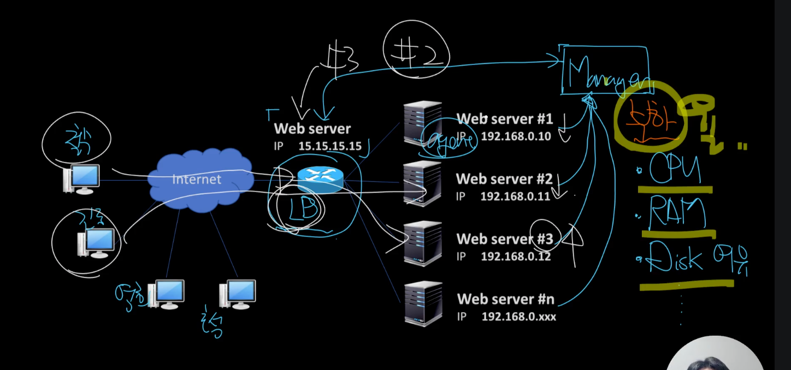

- L4부하분산

- 공유기는 NAPT
- 보통 부하분산이라하면 맨 앞단에서 받아주는 로드벨런서가 연결된 웹서버들에게 전달하는 방식
  - 아무런 체크없이 Round Robin 하기도함
  - 하지만, 아래사진과 같이 Manager라는것을 두어 각 서버들의 헬스체크(CPU, RAM, DISK 여유상태 등을 계산해서 부하율을 구함)를 해서 로드벨런서는 Manager에게 서버들의 부하 정보를 조회해와서, 서비스 사용가능한 서버에게만 전달해줌
    - 
  - 로드벨런서를 이중화
  - 요런것들이 무정지시스템

- 출처: 인프런 네트워크 핵심이론 응용 (널널한 개발자)