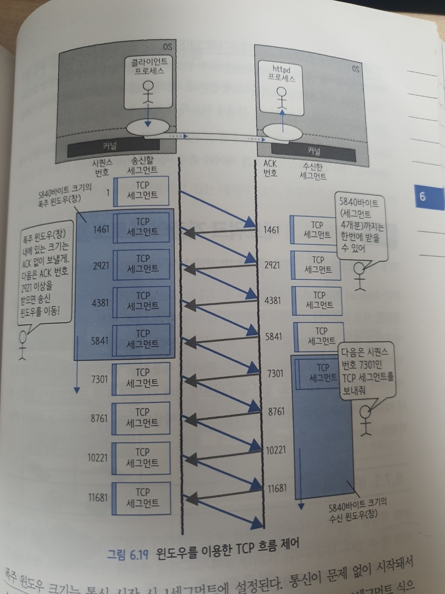

시스템을 연결하는 네트워크 구조 (그림으로 공부하는 IT인프라구조)

- 대개 TCP/IP 구조를 사용해서 데이터를 주고받는다.
- OS(커널)는 TCP/IP를 사용해서 간단히 통신할 수 있는 구조를 제공한다. (그래서 소켓을 통해서 커널에게 요청을 하지)
- 계층구조
  - 각 층은 자신이 담당하는 일만 책임진다
  - 상호 연결돼 있는 계층들간에는 인터페이스만 정의하여 교환한다.
    - 즉, 다른 층이 구체적으로 어떻게 구현되어있는지는 알 필요 없다.
    - 그로 인해 각 층의 구체적인 기술을 변경하기 좋음
    - 하지만 계층이 생김으로인해 그에 따른 오버헤드가 발생하긴함.
  - OSI(Open Systems Interconnection) 7계층
    - 

  - 각 계층끼리는 정의된 프로토콜을 통해서 데이터를 전달한다.
- TCP/IP
  - 인터넷을 포함해서 현재 네트워크를 지탱하는것은 TCP/IP 및 관련 프로토콜
  - 이러한 프로토콜의 집합을 가리켜 TCP/IP 프로토콜 스위트 (Protocol Suite) 라고한다
    - 프로토콜 스위트란 프로토콜 집합이라는뜻. 즉, TCP, IP 프로토콜 외에도 많은 프로토콜이 있다
  - TCP/IP에서는 OSI 7계층의 1~2계층을 모아서 링크계층, 5~7계층을 모아서 어플리케이션 계층으로 취급하여 "TCP/IP 4계층" 모델로 불림
    - 4계층 개념은 RFC1122에서 언급
  - TCP/IP 4계층과 시스템 대응 관계
    - HTTP(어플리케이션 프로토콜) 통신 데이터를 커널영역에서 관리되는 TCP, IP, 이더넷을 지나 최종적으로 이더넷 프레임이 생성. 이 이더넷 프레임이 NIC에 전달돼어, 이더넷 케이블을 통해 인접노드를 겨융해서 최종 위치까지 전달된다
    - 

- 어플리케이션 계층의 프로토콜 (HTTP)
  - 브라우저에 URL을 요청하면, 해당 요청이 웹서버에 도달하고, 웹서버는 HTML 파일을 반환한다. 이때, 브라우저가 HTML파일을 해석하는데, 파일 내에 추가 이미지나 스크립트 등이 포함돼있으면, 다시 웹서버에 요청하게된다.. 즉, 화면 하나를 표시하기위해 몇번이고 요청과 응답을 주고받는다
  - HTTP는 그 하위계층인 IP나 유선을 통해 명령을 보내거나 통신을 제어하지않는다. 즉, 어플리케이션계층의 일만한다.
  - 그리고 HTTP 요청을 받거나 응답을 전달하기위해 "소켓"이라는 파일디스크립터를 사용한다. 즉, 소켓을 통해서 데이터의 송수신이 가능하다!
    - L7에서 데이터를 보낼때, 프로세스가 시스템 콜을 통해서 소켓에 대상 IP를 연결하거나 데이터를 송수신하도록 요청한다..
      - TCP, IP, 이더넷은 커널영역이기떄문
    - 

- 전송계층 프로토콜 (TCP - 여기서는 전달하는 데이터를 **세그먼트** 이라한다)    
  - Transmission Control Protocol : 전송제어하는 프로토콜. 신뢰도가 높은 데이터 전송을 가능케함
    - 여러 경로를 거쳐서 도달하는 인터넷 사용은 신뢰도가 낮은데(중간에 가다가 패킷이 없어질수도..), 이를 보장하기위해서 필요한부분!
  - TCP가 담당하는것은 결국 "신뢰도". 어디로 보낼지 담당하는것이아님.. 그것은 IP에서 하는역할
    - TCP가 아닌 IP만으로도 통신할순 있지만, 상대방에게 확실히 전달됐는지 확인하는 기능이나 도착한 순서를 확인하는 기능이 없음.. 이를 TCP가 해주는것이다
  - 역할
    - "포트번호"를 이용해서 데이터전송
    - 연결 생성
    - 데이터 보증과 재전송 제어
    - 흐름 제어와 폭주 제어
      - 여기서 폭주제어는 네트워크 상에서 접속 폭주(한곳에 집중되는것)를 방지하는 것
        - 인터넷은 공평성이 매우 중요! 그래서 통신 정체가 발생하면 TCP가 통신속도를 자동으로 내림..
  - 커널공간에서의 TCP 처리흐름
    - 데이터를 소켓에 write하게되면, 소켓의 큐를 경유해서 소켓버퍼라 불리는 메모리 영역에서 처리된다
    - 소켓 버퍼는 소켓별로 준비된 전용 메모리인데, 이후 계속되는 IP나 이더넷까지의 일련의 처리도 소켓버퍼 내에서 이루어진다
      - 다른계층에서 동일한 소켓버퍼를 사용하는것은, 같은 메모리 공간내에서 처리하면, 데이터를 복사하지않고 처리가능하기때문
    - `세그먼트` 라는 단위로 관리
      - TCP헤더 + 에플리케이션 데이터
        - TCP헤더(20바이트)에는 도착지점 포트, 출발지 포트, 시퀀스번호, ACK번호, 코드비트, 체크섬 등등 TCP기능을 표현하기위한 여러 정보가 기록됨
      - MSS(Maximum Segment Size) : TCP 세그먼트로 전송할 수 있는 최대 크기(TCP 헤더 포함안함)인데, 특별히 변경하지않으면 1460 bytes 임(MTU가 1500바이트인데 TCP/IP헤더가 40바이트 차지. 즉, 1460 바이트씩 데이터가 쪼개져서 보내진다)
        - 
    - 포트 번호를 이용하여 특정 서버의 어떤 애플리케이션으로 보내는지를 결정
    - 서버측에서 포트를 열어놓고(Listen), 클라이언트측에서 해당 서버의 포트로 연결 요청을 진행하게되면, 3-way-handshake를 통해서 통신이 시작된다
      - TCP통신을 시작하게되면, 상대 서버에 포트 번호와 연결을 열어 달라고 부탁만 할뿐 다른 특별한 일은 하지않는다.. 
        - 그래서 실제 물리적인 경로가 막히거나 통신상대서버가 갑자기 전원이 꺼져도 TCP 연결이 끊어지진않는다.. 그래서 이부분에 주의가필요..
          - 그래도 TCP에는 keep alive 타이머라는 설정이 있어서 여기서 설정한 시간동안(보통 3600초) 통신이 없으면 통신 상대가 존재하는지 확인을 위해 데이터를 전송한다.. 반응 없으면 연결을 닫아버림
            - [참고로, TCP keep alive와 HTTP keep alive는 다르다..!](https://stackoverflow.com/questions/9334401/http-keep-alive-and-tcp-keep-alive)
              - [추가참고사이트](https://devidea.tistory.com/60)
  - 데이터 보증과 재전송제어
    - 수신측에서 TCP 세그먼트가 도착하면, 송신측에게 ACK라는것을 TCP헤더에 추가하여 응답한다.(왕복횟수를 줄이기위해 데이터 전송과 함께 앞서 도착한 데이터의 ACK를 동시에 반환..)
      - 송신측에 ACK를 받지않을때 재전송을위해, 전송이 끝난 데이터라도 소켓버퍼에 남겨둔다..
    - 시퀀스 번호를 붙여서 데이터 순서를 보증한다..
      - 예를들어, 3000바이트의 데이터를 보낼때, 1460바이트, 1460바이트, 80바이트 이렇게 3개의 세그먼트로 분리했다면, 첫번째 세그먼트의 시퀀스 번호가 1, 두번째는 1461, 세번째는 2921이 되어서 이를 활용하여 원래 순서대로 데이터를 조립한다
    - 그렇다면 재전송은 언제?
      - 일정시간내에 응답이 오지않을떄(타임아웃)
      - 동일한 ACK번호가 3번올때..(Duplicate Ack - 중복 Ack)
        - 데이터 중간 번호대가 오지않았을때, 미리 이후번호대의 데이터를 받았다면 이를 다시 보내달라고하지않고 그 이후의 데이터를 요청할수잇다 (SACK - Selective ACK)
    - 
  - 흐름제어와 폭주제어
    - 동기로하면 통신 효율이 나쁘기때문에, ACK를 완전히 기다리지않고 데이터를 보낸다.
    - 그렇다고 아무런 기준없이 계속 이렇게보낼수는 없는데, 이에대한 기준이 "윈도우"라는 개념이다
      - 윈도우에는 데이터를 보내는측의 송신윈도우(폭주윈도우)와 데이터를 받는측의 수신윈도우가 있는데, 기본적으로 수신측이 폭주윈도우와 수신윈도우의 크기를 비교하여 더 작은쪽을 선택하게되고(아마 응답으로 송신윈도우가 얼마다!하고 알려주는듯..?) 데이터 송신시에 해당 윈도우 크기보다 작으면 ACK를 기다리지않고 보낸다. 반면, 해당 보내려는 데이터가 윈도우 크기보다 크면, ACK를 받을때까지 기다리게된다.(즉, 수신측 어플리케이션에서 데이터를 빠르게 처리안하면 송신할때 느려질수밖에없음..) 
        - 송신측에서 ACK를 받게되면, 해당 세그먼트는 재전송이 필요없게되므로 송신용 소켓버퍼에서 삭제하고 송신 윈도우를 다음으로 이동.. (일종의 창이 생겨서 창의 크기보다 크지않으면 ACK받지않고도 보낸다고 생각하면됨.. 그리고 이 창은 줄었다 커졌다하는 창으로 이해하면된다..)
          - 여기서 윈도우의 크기는 ACK 반환시마다 윈도우 크기를 지수적으로 늘려나가는 "슬로우 스타트" 방식으로 만들어진다
            - 처음 1세그먼트로 폭주윈도우 크기가 셋팅되는데 지수적으로 늘어나기때문에 순식간에 커진다.. 
            - 그래서 어느정도까지 크기가 증가하면 이후부터 1씩 증가..
            - 또한 그렇게 보내던 중에 송신중인 세그먼트가 실패하면(폭주하면), 폭주 윈도우 크기를 작게해서 송신량을 줄인다.. 그리고 또 괜찮아지면 늘리고.. 이렇게 조정함.. 
              - 네트워크의 혼잡도도 보면서 폭주윈도우를 변형한다..
              
    - 
- 네트워크 계층의 프로토콜 (IP - 여기서는 전달하는 데이터를 **패킷** 이라한다)
  - TCP 세그먼트가 만들어지면 다음은 IP 처리가 시작
  - IP(Internet Protocol)는 인터넷에서 사용되고있는 프로토콜로, 대표적으로 IPv4, IPv6 두가지가 있다
  - 역할
    - IP 주소를 이용해서 최종목적지에 데이터 전송
      - 데이터 전송을 하지만 반드시 전달을 보장하진않는다.
    - 라우팅
      - 이를 통해서 어떤 링크(NIC)가 패킷을 보낼지 결정한다(default gateway로갈지, 내부 네트워크로갈지.. )
  - 커널공간에서의 IP 처리흐름
    - TCP 계층에서 처리된 데이터에 IP헤더를 추가한다 (이게 IP "패킷"이된다)
    - IP헤더(20바이트)
      - 데이터길이, 프로토콜종류(TCP 등), 최종목적지 서버의 IP, 헤더 체크섬 등이 있음
    - 일반적으로 MTU(Maximum Transfer Unit)이 1500바이트이기때문에, IP헤더(20바이트), TCP헤더(20바이트), TCP세그먼트(1460바이트 - MSS) 이렇게가 한번 보낼수있는 최대이다
  - IP
    - 32bit(4바이트)로 되어있으며, 사람이 읽기쉽도록 8비트와 .(점) 구조로 표현하는게 보통이다
    - IP주소는 네트워크부와 호스트부로 나뉜다
    - 네트워크부는 어떤 네트워크인지를 나타내는데, 32bit중 어디까지가 네트워크부인지를 나타내기위해 CIDR(사이더라고읽음 ex.~~/24 ) 표기를 사용한다
      - 또는 CIDR를 서브넷마스크라고해서 255.255.255.0(/24인경우) 라고 표기한다
      - 24는 맨 앞에서부터 24개의 bit가 1인것이다 (11111111.11111111.11111111.00000000)
    - 호스트 부는 해당 네트워크 내에 있는 소유자를 가리킨다.
      - 192.168.0.1/24 인 경우
      - bit로 나타내면 11000000.10101000.00000000.00000001 로 나타낼수있는데,
        - 맨 앞에서 24개 비트가 네트워크부이고, 뒤에 8개가 호스트부이다
        - 호스트부가 모두 1로 되어있는것은 브로드캐스트주소이다! (호스트로 사용못함)
          - 브로드캐스트로 보낸 주소는 같은 네트워크 내에 있는 모든 호스트에게로 전달된다
        - 호스트부가 모두 0인것은 네트워크주소이다 (호스트로 사용못함)
    - 가정이나 회사내에서 사용하는 사설(private) 네트워크도 RFC 1918에서 정하고 있다..(마음대로 할 수 있는부분이 아님..)
      - 10.0.0.0/8
      - 172.16.0.0/12
      - 192.168.0.0/16
    - 인터넷상에서 통신이 가능한 IP주소가 공공 IP라고함
  - 라우팅
    - IP주소를 이용해 대상 서버를 지정할 수 있으나, 같은 네트워크에 있지않은 대상서버는 **라우터를 통해서** 서버를 찾아가게된다!
    - IP패킷을 라우터가 받으면 해당 IP패킷의 헤더에서 목적지를 확인해서 어디로 보내야할지를 확인한다
      - 이때 사용되는것이 라우팅 테이블(경로표)이다
      - 외부와 접속하는 네트워크는 보통 기본 게이트웨이(default gateway)라는 라우터가 설치돼있다
    
    - IP패킷의 라우팅되는 과정
      - 서버가 IP패킷을 보내려할때, 해당 IP를 자신의 라우팅 테이블에서 찾아본다. 자신이 속한 네트워크에 해당 IP를 찾지못하면 default gateway에 패킷을 전달한다. default gateway를 외부 네트워크에 접속돼 있어서 외부로 패킷을 보내어 자신이 지정한 IP를 찾아가게된다
        - 그렇기 떄문에 라우터가 잘못된 라우팅 테이블을 가지고 있다면 목적지가 이상해질수 있다..
        - 라우터 테이블을 잘못 셋팅해서 혹시나 라우터간에 패킷을 계속 주고받을수도잇는데, 그런것을 방지하기위해 TTL(Time To Live)을 설정한다
          - TTL이 10으로 셋팅되어있으면, 라우터 하나를 경유할때마다 라우터가 IP헤더의 TTL을 하나씩 줄이게된다. 즉, 10번이내에 목적지에 도착해야한다.. 0이되면 패킷을 파기..
      - 
- 데이터 링크 계층의 프로토콜 (이더넷 - 여기서는 전달하는 데이터를 **프레임** 이라한다)
  - 유선 랜에서 사용하는 프로토콜이 이더넷이다.(무선 랜 프로토콜은 이더넷이 아니다)
  - 이더넷을 포함한 링크 계층 프로토콜의 역할은 ***동일 네트워크 내의 네트워크 장비까지 전달받은 데이터를 운반하는것***이다
  - 이더넷 프레임이 전기신호로 전송
    - 그렇기때문에 전기신호의 특성과 관련된 제어기능등 다양한 기능이 포함돼 있다
  - 역할
    - 동일 네트워크 내(링크 내) 데이터 전송
      - 이때 사용되는 주소가 MAC 주소이다
        - L2스위치는 이더넷 헤더를 보고, MAC주소를 연결해준다..
  - 커널 공간의 이더넷 처리 흐름
    - 어떤 링크(NIC)로 갈지는 IP계층에서 정했기때문에, 이제 진짜 어디로 보낼지(MAC주소)를 확인해야한다..
      - 동일 네트워크 내에 있으면 해당 서버에 직접 전송하지만, 다른 네트워크에 있을땐 첫번째 목적지에대한 MAC주소를 확인하여 거기로 보낸다
        - 즉, 실제 내가 찾으려는 서버의 맥주소가 아니라, 목적지까지 가는데 필요한 장비주소가 되는것..
        - 그렇기때문에 이더넷 헤더/푸터는 목적지까지 여러 라우터(or L3 스위치)를 거치는 동안 계속해서 변경된다..
    - 이더넷 헤더에 MAC주소를 목적지로 기입..
      - 여기에 적히는 것은 **동일 링크 내**에 있는 장비의 MAC주소이다!
      - ARP 테이블(MAC 테이블)이라 불리는 표가 있는데, IP주소에 대응하는 MAC주소를 기록한 표이다
    - MTU(Maximum Transfer Unit) : 링크 층에서 하나의 프레임으로 전송할 수 있는 최대 크기
      - 일반적인 이더넷에서 150바이트로 설정돼 있음
    - 
  - 동일 네트워크 내의 데이터 전송
    - MAC주소 : 네트워크 통신을 하는 하드웨어에 할당된 주소.. 모든 장비가 고유한 물리 주소를 가지고있다.. (48비트.. 보통 16진수로 표현)
    - 이더넷으로 통신할 수있는 것은 동일 네트워크이기때문에, 브로드캐스트로 통신을 하게되엇을때(이때 맥 주소는 FF-FF-FF-FF-FF-FF), 다른 네트워크로는 전달이 안된다
    - 
- 기타 팁
  - 표준화단체
    - IEEE (Institute of Electronics Engineers)
      - 전기전자 기술자 협회
      - 무선 LAN 프로토콜
      - 이더넷도 IEEE가 표준을 만들었지만, 실제 사용되고있는것은 이더넷2 라는것으로서 IEEE가 만든것과 다름.. 
        - 이더넷2는 DEC, 인텔, 제록스사에서 함께 만듦
    - IETF (Internet Engineering Task Force)
      - 인터넷에서 사용되는 다양한 기술을 표준화하는 단체
      - RFC라는 이름의 문서로 나외있음
        - RFC는 Request For Comment (의견모집) 이라는 뜻인데, 그만큼 인터넷 기술이 대중들에게 얼마나 공개되어있는지를 알 수 있다
        - 인터넷의 기본적인 부분은 RFC 791에서 정의
        - HTTP 사양은 RFC2616에 정의
  - Keep-alive
    - HTTP는 기본적으로 요청/응답 관계가 한번 끝나면 세션 종료한다..
    - 그로인해 한 화면에 이미지가 많이 포함되어있으면 TCP 3-way-handshake를 계속하게되니깐 그만큼 오버헤드가 발생한다..
    - 이를 막기위해 단시간동안만 세션을 남겨두는 기능을 Keep-Alive 라고한다
    - 웹서버 측에 세션 잔존 시간을 설정. 
    - http 헤더에 "Connection"에 "keep-alive"가 있으면 해당 기능이 켜진것.. 반대로, "close"라고 되어있으면 꺼진것!
    - 주의할점은, Keep-alive 할 시간인데, 해당 시간을 너무 길게 잡으면 신규 요청이 받을수 없기에 적당한 시간을 잡아야한다.. (평균응답시간+a) 
      - 물론.. 겁나 많은 연결이어야겠지..
  - L2 스위치는 이더넷 헤더를 보고 목적지를 정하지만, L3 스위치나 라우터는 IP헤더까지 결정해서 목적지를 결정한다..
  - NIC로 프레임이 도착하면 일단은 NIC 수신큐에 저장해서 OS 끼어들기나 OS 폴링을 이용해서 커널 내에 프레임을 복사한다. 그리고 이더넷 헤더와 푸터를 제거하고 IP패킷을 꺼낸다. 여기서 IP주소를 확인해서 자신에게 보낸 패킷이 맞는지 확인하고 맞다면 IP헤더를 제거하고 TCP 세그먼트를 꺼낸다. TCP 포트를 확인해서 포트 번호에 대응하는 소켓에 데이터를 전달한다. TCP는 신뢰성있는 프로토콜이므로 재구성을 위한 세그먼트가 모두 도착하기까지 버퍼에서 기다리는 경우도 있다. 그리고 모두 왔다면, TCP 헤더를 제거하고 안에 있는 데이터를 소켓을 통해 어플리케이션에게 전달한다
    - 

- 이거보고 필요한 내용 추가하기..
  - https://d2.naver.com/helloworld/47667

- [MAC 주소찾는과정 설명](https://popcorntree.tistory.com/85)