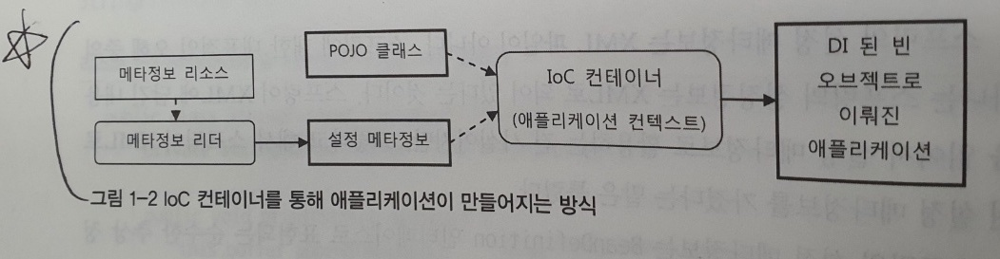
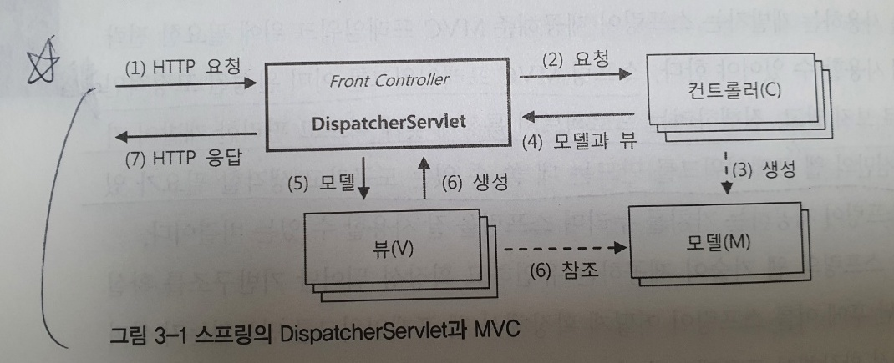

# 토비의 스프링 vol2

- 1장 IoC 컨테이너와 DI
  - 왜 IoC?
    - 컨테이너가 오브젝트에 대한 제어권을 갖고있어서 IoC (코드가 오브젝트를 제어하지않음!)
  - IoC 컨테이너 = 어플리케이션 컨텍스트 = 빈 팩토리
    - 어플리케이션 컨텍스트 (빈 팩토리를 상속받고있음..)
      - 엔터프라이즈 애플리케이션 개발하는데 필요한 여러가지 기능 + 빈 팩토리
    - 빈 팩토리
      - 오브젝트 사이의 관계 설정
  - IoC 컨테이너 사용을 위해서는 메타정보가 필요하다. 여기서 메타정보는 빈을 어떻게만들지, 어떻게 동작하게할지를 정의한 정보다
  - 스프링 애플리케이션이란, POJO클래스와 설정메타정보를 이용해 IoC 컨테이너가 만들어주는 오브젝트의 조합이라고 할수있다!
    - 
      - 리더만 잘 만들면 어떤 형태로도 빈 설정 메타정보를 작성할 수 있다!
  - IoC컨테이너는 오브젝트 단위로 관리함!
    - 클래스 하나에 여러 오브젝트를 만들수 있고, 이 오브젝트들을 IoC컨테이너가 관리하기 때문에 클래스단위가 아니라 오브젝트 단위로 관리된다.
  - IoC컨테이너 종류
    - StaticApplicationContext, GenericApplicationContext, GenericXmlApplicationContext, WebApplicationContext...
      - WebApplicationContext
        - 서블릿 컨테이너 : 요청을 받아서 서블릿을 동작시켜줌
          - 서블릿 : IoC 컨테이너에서 필요한 빈을 받아놓고 요청이 들어오면 해당 요청에 맞는 적절한 빈을 호출(web에서는 DispatcherServlet이 해당역할)
  - IoC 컨테이너 계층 구조
    - 트리모양의 계층구조를 사용하여 IoC 컨테이너는 하나 이상을 만들수 있다
    - 검색순서는 항상 자신이먼저! 그 다음이 직계부모(자신이 부모꺼 오버라이딩했다면 부모꺼 당연안불러온다~)
    - 웹 어플리케이션의 IoC 컨테이너 구성(p76참고)
      - 루트 applicationContext + 서블릿 컨텍스트(이거는 여러개될수있음. 부모컨텍스트가 루트 application context)
      - 꼭 반드시 두개이상을 사용해야하는것은 아님..
        - 스프링 웹기술을 사용하지않는다면 루트 애플리케이션 컨텍스트만 등록하면됨
        - 서블릿 컨텍스트 단일구조로 사용하기도함
  - 컨테이너가 자동등록하는 빈
    - ApplicationContext
    - BeanFactory
      - ApplicationContext도 BeanFactory를 상속받고있지만, 내부적으로 빈 팩토리 오브젝트를 별도로 만들어놓고 위임하는 방식으로 돌아가기때문에, BeanFactory를 직접적으로 주입받는객체랑 ApplicationContext의 BeanFactory 객체는 다르다!
    - ResourceLoader
      - 리소스 로드 가능
      - applicationContext가 상속받고있음
    - ApplicationEventPublisher
      - 컨테이너 안의 빈 오브젝트간에 이벤트 발생 & 전달받을수있는기능
      - 굳이 컨테이너에 의존적인 방법 사용할 필요가 없기에 거의 사용안함(필요하면 빈 사이에 독자적인 이벤트/리스터 구성을 사용하면됨)
    - systemProperties
      - JVM관련 설정값들
      - ```System.getProperty("")``` 와 같이 쓰는것이 좋음 (Property로 구현되어있기에, 타입으로 가져오기가좀.. 굳이 가져오려면 @Resource Properties systemProperties)
      - 해당 빈 이름은 사용하지말것! (systemProperties 는 빈이름등록금지)
    - sysetmEnvironement
      - 시스템 환경변수관련 (OS 종류나 서버환경 설정에 따라 달라질수있음)
      - ``` @Value(#{systemEnvironment['Path']}) String path; ```와 같이 사용가능
      - 해당 빈 이름은 사용하지말것! (sysetmEnvironement 는 빈이름등록금지)
  - 프로토타입과 스코프
    - 프로토타입
      - 생명주기 
        - 컨테이너가 생성은 해주지만, 그 이후의 관리는 주입받은 빈이 알아서 해야함
      - 용도
        - new 키워드로 ***매번 새롭게 생성***해 주어야할때, 컨테이너에 등록된 ***빈을 주입받아야 한다***면 프로토타입을 사용하자!
      - 사용방법
        - DI
          - @Scope에 proxyMode를 설정해줌
            - proxymode를 사용하면 보통 DI처럼 사용가능하며, 주입된 객체는 프록시패턴을 통해 만들어진 오브젝트이다. 이 오브젝트가 스코프에 적절히 맞추어 객체를 연결시켜준다
              - 겉으로만 봐서는 프록시 객체를 사용한것인지 당연 알수없음.. 하지만 내부적으로는 proxymode에 정의된대로 오브젝트를 연결해줌
              - *proxyMode 종류
                - ScopedProxyMode.INTERFACES : 프록시 빈이 인터페이스를 구현하고있고, 클라이언트에서 인터페이스로 DI받을때 사용 (jdk dynamic proxy 사용)
                - ScopedProxyMode.TARGET_CLASS : 프록시 빈 클래스를 직접 DI 할때 사용 (cglib 사용)
                  - 위 둘 차이 설명 : https://stackoverflow.com/questions/21759684/interfaces-or-target-class-which-proxymode-should-i-choose
                  - 결론은 인터페이스를 사용하고있으면 INTERFACES를, 그렇지않으면 TARGET_CLASS를 사용하면됨
        - DL(dependency lookup)
          - Provider\<T\> 사용
            - JSR-330(DIJ) 에 추가된 표준인터페이스
            - @Autowired로 주입받고 get()으로 가져오면 끝
  - 싱글톤, 프로토타입 외 스코프 (웹 환경에서만 의미가 있음)
    - 프로토 타입과는 달리 스프링이 초기화에서부터 ***제거***까지 모두 관리
    - 사용방법 : 프로토타입과 동일
    - 종류
      - 요청 스코프
        - 요청별로 독립적인 빈이 만들어짐.
        - 상태값을 저장해둬도 안전
      - 세션 스코프
        - Http 세션과 같은 존재 범위를 갖는 빈
        - 세션 타임이 종료될때까지유지되므로 로그인 정보나 사용자별 선택옵션 등을 저장해두기에 좋음
      - 애플리케이션
        - 서블릿 컨텍스트에 저장되는 빈 오브젝트
        - 컨텍스트가 존재하는 동안 유지되는 싱글톤 스코프와 비슷한 존재범위를 가짐
        - 멀티스레드에 주의할것
  - 빈 생명주기 메소드
    - 초기화 메소드
      - 빈 오브젝트 생성 + DI 완료된 이후 진행
      - @PostConstruct
    - 제거메소드
      - 컨테이너가 종료될때 호출. 빈이 사용한 리소스 반환하거나 종료전에 진행
      - @PreDestory
  - 빈의 종류
    - 애플리케이션 로직 빈(0) : 비지니스 로직, 서비스 오브젝트 , DAO..
    - 애플리케이션 인프라 빈(0) : 대개 스프링에서 제공하는 추상화 되어있는 빈.. 직접 로직작성은 안하고 애플리케이션 로직 빈에 영향을 주는 빈. 기술API도 여기 속함 ex) 트랜잭션, DataSource
    - 컨테이너 인프라 빈(2) : 스프링 컨테이너 기능을 확장해서 빈의 등록과 생성, 관계설정, 초기화 등의 작업에 참여하는 빈 ex) AOP
      - 빈 후처리기 구현체들이 여기에 속하겠지.. (ex. \<context:component-scan\> 설정했을때 생성되는 빈들)
  - 런타임환경과 프로파일
    - 환경에 따라 설정파일 외에도 등록하는 빈이 달라져야 할때가 있는데, 지정한 프로파일에 따라 빈이 생성될수 있도록 가능!
    - 런타임 환경은 애플리케이션 컨테스트에 새롭게 도입된 개념!
    - 컨텍스트 내부에 Environment 인터페이스를 구현한 런타임 환경 오브젝트가 만들어져서 빈을 생성하거나 의존관계를 주입할때 사용한다
      - 런타임 환경은 "프로파일"과 "프로퍼티 소스" 로 구성되는데, 환경에 따라 프로파일과 프로퍼티 소스가 다르게 설정된 Environment 오브젝트가 사용
      - 프로파일안에 환경에 따라 각기 구성되는 빈들을 정의해놓으면, 애플리케이션 컨택스트가 시작될때 지정된 프로파일을 실행시킴으로써 환경에 필요한 빈을 만드는개념이다!
        - @Profile("dev") 로 선언하면 spring.active.profile이 dev일때만 실행된다.. (활성 프로파일은 prod로 해놓으면 당연실행안됨)
        - 아무것도 지정하지않으면 어떤 프로파일이던 상관없이 실행
        - @Profile("dev","prod") 이렇게 여러개도 지정가능
  - 프로퍼티 소스
    - 스프링에서 사용되는 프로퍼티 종류
      - 환경변수
        - OS의 환경변수. OS 레벨에서 동일한 값을 전달해야할때 사용
        - System.getEnv()
      - 시스템 프로퍼티
        - JVM 레벨
        - System.getProperties()
      - JNDI
        - 웹 어플리케이션 레벨
      - 서블릿컨텍스트 파라미터
        - 웹 어플리케이션 레벨. JNDI값을 설정하기 번거로울때
        - web.xml에 서블릿 컨텍스트 초기 파라미터를 프로퍼티로 사용가능
        - \<content-param\> 
        - @Autowired ServletConetxt servletContext
      - 서블릿 config 파라미터
        - 해당 서블릿의 서블릿 컨텍스트에만 영향. 즉, 위의 종류중에 범위가 제일 좁음
        - \<init-param\>
        - @Autowired ServletConfig servletConfig
    - 프로파일의 통합과 추상화(Environment)
      - 프로퍼티의 종류와 그에 따라 달라지는 접근 방법을 프로퍼티 소스라는 개념으로 추상화
      - 이를 통해 일관된방식으로 접근. 동일한 이름이 있을 경우에 우선순위에 따라 정해짐!
      - 사용방법
        - Environment.getProperty()
        ```java
          @Autowired
          Environment env
          ..
          env.getProperty("os.name");
        ```
        - PropertySourceConfigurerPlaceholder 빈 등록 & @Value
        ```java
          @Value("${db.username}")
          private String userName;
        ```
      - @PropertySource("classpath:/database.properties")
        - 이렇게 가져올수있음
        - 컨텍스트에 기본적으로 등록되는 프로퍼티 소스보다 우선순위 낮음
          - 우선적용하고 싶은 프로퍼티있거나 기타 프로퍼티 관련한 내용은 아래 래퍼런스 참고할것!

      - 스프링부트에서 프로퍼티 활용하는 레퍼런스
        - https://docs.spring.io/spring-boot/docs/current/reference/htmlsingle/#features.external-config

           
  - 1장을 통한 기타팁
    - /WEB-INF/**/*Context.xml (web.xml)
      - WEB-INF 폴더 밑의 모든 서브폴더에 Context.xml로 끝나는 모든 파일을 찾는다
    - 스테레오타입 애노테이션 : 디폴트 필터에 적용되는 애노테이션
      - 종류
        - @Component 
        - @Service : 서비스계층에서 사용
        - @Controller : MVC 컨트롤러에 사용. 스프링 웹 서블릿에 의해 웹 요청을 처리하는 컨트롤러 빈으로 선정됨
        - @Repository : 데이터 엑세스 계층의 DAO 또는 repository 클래스에 사용. DataAccessException 자동변환과 같은 AOP 적용 대상을 선정하기 위해서도 사용
    - @Configuration 클래스에 @Bean으로 생성한 빈 오브젝트들을 @Bean으로 등록한 함수로 호출하게되면, 몇번을 호출하던 싱글톤으로 동일한 빈을 전달해준다.(프록시 적용! CGLib..) 그러나, @Component 클래스에 @Bean으로 생성된 오브젝트를 함수로 호출하게되면, 호출할때마다 새로운 오브젝트가 등록이된다!
    - component-scan 태그는 애노테이션 의존관계 설정을 지원한다(의존관계 설정도하고 필요에따라 빈도 등록하고..)
      - annotation-config 태그는 이미 등록된 빈의 메타정보에 프로퍼티 항목을 추가해주는 작업! 새로운 빈을 등록해주지는않음!
    - @Resource는 빈의 이름을 이용해서 빈을 찾음
    - @Autowired는 빈의 타입을 이용해서 빈을 찾음
      - @Inject는 JSR-300(DIJ) 에서 제공해주는데, 이는 Autowired 와 같은기능!
      - 생성자에서도 사용할수있는데, 생성자 여러개 있을때 어떤것을 Autowired 사용할 것인지 명시해주어야 에러가 안난다
      - 꼭 생성자를 이용해서 DI 방식을 사용하는것이 정답은아님!
        - 디폴트 값을 주고 선택적으로 DI할수있또록 만들어야할때는 수정자메소드 주입이 더 좋겟지?
      - 동일한 타입이 여러개 빈으로 등록록되어있으면, Set, List로 가져올수있다
        - Map<String,Object>로도 가져올수있는데 key에는 bean 이름이 들어감
      - @Qulifier
        - 기본적으로 bean으로 등록된 놈이 qulifier(한정자) 를 가지고있는지 찾고, 없으면 빈 이름으로 찾는다. 즉, @Qualifer는 빈 생성시 전달한다.. "Autowired를 사용했을때 특정 한정자에 의해 한정을 시킨다!" 로 qualifer를 이해하자..
          ``` java
          @Component
          @Qulifier("abc")
          class Kkk{
              ...    
          }
          ```
        - 빈에 부가적인 속성을 지정해주는효과있음
        - 스프링은 @Qualifier를 메타애노테이션으로 갖는 애노테이션도 @Qualifier 취급을 해준다!
        - Qualifer(한정자) 사용해서 주입하려하는데, 적절한 Qualifier를 사용해서 등록된 빈이 없다면, 그냥 빈 이름으로 찾아줌
      - 꼭반드시 bean이 주입되어야하는게 아니면 @Autowired의 required 엘리먼트를 false로! 
        ```java
            @Autowired(required=false) Printer printer;
        ```
      - @Bean 을 통해서 빈을 등록할떄, 선언한 메소드는 자동주입되므로 @Autowired와 동일하게 동작한다(@Bean이 @Autowired를 포함한다고 보면됨!)
    - @Value는 필드, 수정자메소드, 메소드파라미터에서 사용가능
    - 프로퍼티 파일을 이용한 값 설정
      - 수동변환(PropertyPlaceHolderConfigurer)
        - 프로퍼티 치환자(placeholder)를 사용
        - 빈 팩토리 후처리기에서 실행됨(빈 후처리기가 아님)
          - 빈 후처리기는 매 빈 오브젝트가 만들어진 직후에 오브젝트의 내용이나 오브젝트 자체를 변경할때 사용하고, 빈 팩토리 후처리기는 빈 설정 메타정보가 모두 준비됐을대 빈 메타정보 자체를 조작하기 위해 사용
          - property 파일을 읽어서 메타정보의 값 정보에서 치환자(${}) 를 후처리기 시점에 찾아서 적절한 value로 바꿔준다!
          - 빈 팩토리 후처리기가 빈 후처리기보다 앞서서 있는듯함
            - 필드에 @Value로 셋팅하였을때, 생성자 호출하는 시점에는 값이 주입되어있지않은데, 메소드 수정자 주입시에는 값이 주입되어있었음.. (더 확실히 알기위해서 좀더 찾아봐야할듯)
      - 능동변환(SpEL)
        - #{} 사용
        - 표현식을 사용해 다른 빈 오브젝트에 직접 접근할수도있음
          - ex) #{hello.name} (hello라는 빈 이름의 name 프로퍼티) 
    - 프레젠테이션 계층의 입력방식에 따라서 비지니스 로직을 담당하는 코드가 휘둘리지않고 독립적으로 존재하기 위해서는 최대한 도메인객체를 참조하도록 해야한다(도메인 객체만 잘 만들어져있다면...)
      - 컨트롤러에서 요청받은 데이터를 오브젝트에 담았을때, 해당 오브젝트에 도메인 객체를 담고있다면, 이는 컨트롤러에서 요청하는 데이터가 변경된다할지라도 서비스 계층에서 데이터를 사용하는데에 있어서 큰 변경이 없을것이다!
      - 그리고 여기에서 컨트롤러에서 요청시 데이터를 오브젝트에 담을때 새롭게 객체를 생성할텐데, 도메인 객체에 데이터를 셋팅하기위해서 DAO를 통해서 데이터를 select해 올 필요가 있을수있다. 이때 오브젝트는 요청마다 새롭게 생성되고, 컨테이너 등록된 빈(dao)을 사용해야하므로 프로토타입으로 사용하는것이 좋다!
    - @Import
      - @Configuration 클래스 가져온다! @Enable.. 클래스에서 많이 사용된다함
    - @Configuration은 각각 하나의 XML과 같다고 볼수있다! 설정의 성격에 따라서 잘 분리하자!! 
    - @EnableTransactionnManagement
      - 트랜잭션 사용할때 사용.. @Transactional 사용하기 위한 AOP 관련 빈들을 등록해줌
      - 스프링부트에서도 반드시 써야하는것인지 확인필요(어떤 의존성을 불러오면 자동으로 등록되는것같긴한데.. 확인필요하다!)
    - 프로퍼티 파일은 저장소에 올리지 말자! 그냥 sample properties만 올릴것!
    - 롤백 테스트는 내장형 DB로 확인하는것도 좋다!
    - -D 옵션은 JVM 옵션 (-Dspring.profile.active=prod)
    - 팩토리 빈을 통해서 빈을 등록하는 방법 정리(자세한 factory bean 관련 내용은 toby Spring vol 1을 참고할것!) : https://live-everyday.tistory.com/224

- 2장 데이터 엑세스 기술 (해당 기술의 자세한 내용은 필요할때 다시 참고하면 좋을듯)
  - DAO 패턴
    - 도메인 오브젝트만을 사용하는 인터페이스를 통해서 데이터 엑세스 기술을 외부에 노출하지않도록 만드는것! => POJO => 기술에 영향x, 단위테스트 용이
    - 예외도 checked error 나 특정 기술에 종속되어있는 에러x.. 또한 되도록 런타임에러로뺄것!
      - 런타임 에러로빼는이유는 데이터 엑세스 중에 발생하는 예외는 대부분 복구할수 없기때문!
  - JDBC
    - 스프링의 JDBC 접근방법
      - JdbcTemplate(Datasource)
        - 파라미터 소스
          - 쿼리에서 값이 매번 달라지는 경우, 치환자를 만들어서 바인딩하는 방법을 사용하는게 좋은데, 바인딩을 위해 넘겨주는 값을 파라미터 소스라고 한다
          - ex) INSERT INTO MEMBER(ID,NAME,POINT) VALUES(:id,:name,:point); 라면, :id, :name, :point에 값을 바인딩해줌
          - 종류
            - Map/MapSqlParameterSource : key, value 값으로 전달해주고, key값으로 바인딩함 ex) key가 id,name,point 이렇게 들어가있어야함
            - BeanPropertySqlParamenterSource : 자바빈 스타일의 오브젝트를 전달해주면 해당 필드 이름으로 바인딩함
        - RowMapper
          - 데이터를 읽어올때 BeanPropertyRowMapper를 넘겨주면, BeanPropertyRowMapper를 생성할때 넘겨준 클래스를 바탕으로 데이터를 바인딩하여 해당 객체를 리턴해줌
      - SimpleJdbcInsert
        - DB메타정보 활용하여 db에 insert하는데 용이하게 해줌
        - insert 할때 일일이 컬럼 일일이 추가해서 쿼리만들 필요없음! 어떤 테이블에 insert할건지만 명시해주면 해당 테이블의 메타정보를 가져와서 셋팅
        - 이를 통해서 자동증가 컬럼은 제외할수도잇으며, 자동증가 컬럼의 현재값도 가져올수있다!
      - SimpleJdbcCall
        - 프로시저나 함수 콜
    - 스프링 JDBC가 해주는 작업
      - connection 열기와 닫기
        - connection 열고 닫는 시점은 스프링 트랜잭션 기능과 맞물려서 결정
      - statement(preparedstatement) 준비와 닫기
      - statement 실행
      - resultset 루프
      - 예외처리와 변환
        - 런타임예외로 변경
        - 일관된 DataAccessException 계층구조내의 예외로 전환
      - 트랜잭션 처리
      - *개발자가 해야할작업 : SQL, SQL에 넘겨줄 파라미터, 실행결과를 어떤 오브젝트에서 받을것인지, DB 커넥션 가져올 DataSource 정의
    - 스프링 JDBC DAO
      - 도메인 오브젝트 or 테이블 단위로 DAO 생성! => DAO는 여러개
  - ORM
    - 스터디필요
  - 트랜잭션
    - 트랜잭션 추상화와 동기화
      - 트랜잭션 추상화 
        - 트랜잭션 서비스의 종류나 환경이 바뀌더라도 트랜잭션 사용하는 코드는 그대로유지!
        - PlatformTransactionManager(구현체로는 jdbc, jpa, hibernate 등이있음)
          - 구현체
            - DataSourceTranactionManager
            - JpaTransactionManager
            - HibernateTransactionManager
            - JtaTransactionManager
              - 여러개 DB를 사용할때, 꼭 DB뿐 아니라 JMS와 DB 등 짬뽕된 트랜잭션이 필요할때, 여러대 서버에서 분산되어 진행되는 작업 등 트랜잭션으로 연결이 필요할때 사용!
              - 이를 지원하는 WAS를 사용하거나, 독립적으로 사용할수있도록 해주는 프레임워크가 필요함
          - 만약 Datasource가 다르고 각 Datasource에 대한 트랜잭션을 사용해야한다면 당연히, 각 Datasource를 가지고 트랜잭션매니저를 등록하면됨. 즉, 2개 등록..
            - @Tranactional 에서 사용해야할 트랜잭션 매니저를 지정하면됨
      - 트랜잭션 동기화
        - 트랜잭션을 일정 범위 안에서 유지해주고, 어디서든 자유롭게 접근할수있게 만들어줌!(이로 인해 전파(propagation) 옵션을 활용가능)
    - 트랜잭션 경계설정 방법
      - 코드로짜기
        - PlatformTasactionManager를 직접사용해도되나, try catch 블록을 써야하므로 TransactionTemplate을 이용하면 좋음
        - TransactionTemplate(PlatformTrasactionManager)
        - 트랜잭션 관련 ***디버깅할때는 PlatformTasactionManager***를 사용하는것이 좋은데, 해당 객체에서 getTransaction()으로 전달받은 ***TransactionStatus*** 객체를 이용하면 현재 트랜잭션이 새로 시작된것인지 기존 트랜잭션에 참여한것인지 또는 종료된 것인지 모두 확인가능!
      - 선언적 트랜잭션 경계설정
        - 선언적 트랜잭션 경계썰정은 트랜잭션 프록시빈(빈 후처리기에서 프록시 오브젝트를 반환) 덕분에 가능!
        - 방법
          - xml 설정파일에 pointcut, advice 정의 
            - pointcut은 기본적으로 ***인터페이스***에 적용!
              - 스프링AOP의 동작원리인 JDK 다이내믹 프록시는 인터페이스를 이용하여 프록시를 만들기떄문!
              - 그러나, 인터페이스없이 프록시를 만들수도있긴함...
              - *특정 클래스로 지정해서 aop를 적용하면, 트랜잭션 적용과 상관없는 메소드도 포인트 컷의 선정대상이된다.. 불필요한 리소스 소모.. 인터페이스 분리 원칙에 따라 클라이언트가 필요한(실제적으로 DB의 데이터를 핸들링하는 기능)것만 나타나있고, 바로 그 기능들이 트랜잭션 적용대상들이여야하므로 인터페이스를 기준으로 적용하는것이좋음!(하지만 이게 또 어노테이션 쓸때는 꼭 인터페이스에 적용하는게 좋지않음..)
          - 어노테이션(@Transactional)
          - 참고사항
            - 프록시 모드 (JDK 다이내믹 프록시 vs CGLIB)
              - CGLIB 사용 
                - 보통 인터페이스를 사용하지않을때, 클래스 레벨의 프록시를 사용하도록해줌(런타임 바이트 코드 생성기법을 이용해서 적용함)
                - 상속해서 프록시를 만드는 개념이기때문에, final로 선언된 클래스는 안됨
                - public으로 정의된 모든 메소드에 적용이 되기때문에, 수정자와 같은, 트랜잭션적용이 필요없는 메소드도 적용이 됨
                - @EnableTransactionManager에 Proxy-target-class를 true로 변경해야하고(기본값 false) 인터페이스가 아닌 클래스에 선언해야한다
                  - 만약 인터페이스에 적용하고 proxy target class를 true로햇다면 트랜잭션 안먹는다
                  - 또한 proxy target class를 별도로 설정하지않고 클래스에만 선언하게되면 JDK 다이내믹 프록시로 진행됨
            - AOP 방식(프록시 vs AspectJ)
              - 프록시
                - 스프링의 AOP 방식
                - CGLib든 JDK 다이내믹 프록시든 모두 어쨋든 프록시 사용하는것.. 그래서 해당 클래스 내부에서 바로 트랜잭션 적용되어있는 자신을 호출하면 트랜잭션 안먹는다..(타깃오브젝트의 자기호출) 외부에서 호출해주어야함..
              - AspectJ
                - 프록시를 타깃 오브젝트 앞에 두는 방식이 아닌, 타깃 오브젝트 자체를 조작해서 부가기능을 직접 넣는 방식. 처음부터 타깃 오브젝트의 클래스에 부가기능을 가진 소스코드가 있었던 것처럼 만들어줌
                - 프록시 방식을 사용할때 외부에서 호출해주어야하는 한계점을 이를 통해서 해결가능
                - @EnableTransactionManager에 mode를 aspectJ로 해주어야함
                  - 클래스 레벨, 클래스 메소드레벨에 적용해야함(인터페이스x)       
      - 트랜잭션 속성
        - 전파(propagation)
          - 트랜잭션을 시작하거나 기존 트랜잭션에 참여하는 방법을 결정하는 속성
        - 격리수준(isolation)
          - 트랜잭션이 진행될때 트랜잭션의 작업결과를 여타 트랜잭션에게 어떻게 노출할 것인지를 결정
          - 예를들어, 격리수준이 REPEATABLE_READ라면, 내가 읽은 데이터를 다른 트랜잭션이 수정하는것을 막아줌. 하지만 다른 트랜잭션이 새로운 로우를 추가하는것은 제한하지않는다..
        - 제한시간(timeout)
        - 읽기전용(read-only)
          - 성능 최적화도된다함..
          - 쓰기작업 막을수있음
        - 롤백예외(rollbackFor)
          - 특정 에러클래스를 발견하면 롤백하라!
          - 기본적으로 런타임에러만 롤백하고, checked error는 롤백대상이 아닌데, 여기서 지정해주면 해당 checked error도 롤백대상이됨
          - @Transactional(rollbackFor=NoSuchMemberException.class)
        - 커밋예외
          - 런타임 예외라도 발견하면 롤백하지말고 커밋해!
          - 사용방법은 롤백예외랑 동일
      - 데이터 엑세스 기술 트랜잭션의 통합
        - 트랜잭션 매니저별 조합가능기술
          - 하나의 트랜잭션 매니저를 사용해서 여러 DA 기술이 짬뽕되어있는 상태에서도 트랜잭션 적용가능!
          - 물론, ***같은 Datasource***를 봐야함!
          - 두개 이상의 여러DB 사용할때도 트랜잭션 필요하다면 JTA 사용해야함 
        - ORM과 비ORM DAO를 함께 사용할때 주의사항
          - ORM은 바로 DB에 반영하지않고 캐시로 수행해야할 작업을 가지고있다가 일괄적으로 반영한다. 그로인해서 비ORM과 서비스내에 같이 있다면 생각했던 결과와 다를수있다(비ORM은 바로 DB에 반영)
          - 이를 해결하기위해 비ORM과 같이 사용할때는 ORM의 flush()를 사용해서 바로 DB에 반영시켜주는것이 좋다. (이또한 AOP로 셋팅이 가능하다하는데, 자세한건 JPA와 같은 ORM 스터디가 필요할듯!)
           
  - 2장을 통한 기타 팁
    - 서버가 제공해주는 DB풀을 사용해야하는 경우에는 JNDI를 통해 서버의 DataSource에 접근!
    - ORM : 오브젝트와 RDB사이에 존재하는 개념과 접근 방법, 성격의 차이 때문에 요구되는 불편한 작업을 제거해줘서, 자바 개발자가 오브젝트를 가지고 RDB에 적절한 형태로 변환하거나 반대로, RDB에 저장되어 있는 정보를 자바 오브젝트가 다루기 쉬운 형태로 변환해주는 기술!
      - ORM 사용하면 SQL문장을 직접 작성x
      - 즉, 쉽게 이야기하면 자바 오브젝트와 RDB사이에 ORM 프레임워크가 적절히 맵핑해주어, 데이터를 오브젝트 관점에서 핸들링 할수있는것!
      - @EnableTransactionManager를 통해서 트랜잭션 AOP관련한 인프라 빈들이 등록됨.. 스프링부트에서는 jdbc사용하면 자동으로 등록이되는듯..
- 3장 스프링 웹 기술과 스프링 MVC
  - 기본적으로 서비스 계층과 데이터 엑세스 계층을 담은 ***루트에플리케이션 컨텍스트***와 스프링 웹 기술을 기반으로 동작하는 웹 관련 빈을 담은 ***서블릿 에플리케이션 컨텍스트***로 분리된다
    - 이를 통해서 다른 웹 기술을 사용할때 언제라도 대체가 가능할수있도록 할 수 있다.
  - 스프링 MVC와 DispatcherServlet 전략
    - 스프링은 기본적으로 추상화를 기반으로 기술이 바뀐다한들 비지니스 로직이 변경되지않도록 해준다. 스프링 MVC와 DispatcherServlet 또한 이를 기반으로 만들어져있다. 하지만 중요한것은 추상화를 기반으로 프로젝트에 맞는 구체적인 프레임워크를 만들어 나가야한다. RoR과 같은 일체형 고속개발 프레임워크는 기술에 대한 자기주장이 강한데, 스프링 프레임워크 또한 궁극적으로 빠른 개발을 위해서는 추상화를 기반으로 특정 프로젝트에 맞는 최적화된 구조를 만들어내고, 관례를 따라 빠르게 개발 가능한 스프링 기반 프레임워크를 만들어서 사용해야한다!
    - 스프링 MVC 프레임워크를 이미 완성된 고정적인 프레임워크로 보지말고, 진행하려는 프로젝트의 특성에 맞게 빠르고 편리한 개발이 가능하도록 자신만의 웹 프레임워크를 만드는데 쓸 수 있는 도구라고 생각할 필요가 있다! 
    - DispatcherServlet과 MVC 아키텍처
      - MVC 
        - M(model) : 프레젠테이션 계층의 구성요소 정보를 담은 모델
        - V(view) : 화면 출력 로직을 담은 뷰
        - C(Controller) : 제어 로직을 담은 컨트롤러
      - MVC 아키텍처는 프론트 컨트롤러 패턴과 함께사용
        - 프론트 컨트롤러 패턴 : 중앙 집중형 컨트롤러를 프레젠테이션 계층의 제일 앞에 둬서 서버로 들어오는 모든 요청을 먼저 받아서 처리(DispatcherServlet이 그 역할을함)
          1. 공통적인 작업을 먼저수행
          2. 적절한 세부컨트롤러로 작업 위임
          3. 클라이언트에게 보낼 뷰 선택해서 최정결과 생성
          4. 예외가 발생했을때 이를 일관된 방식으로 처리
          - 
          - (1) Http 요청 접수
            - 지정한 패턴에 맞추어 요청이 들어오면, 해당 DispatcherServlet으로 전달.
            - 공통적으로 진행해야하는 전처리 작업(보안, 파라미터 조작, 한글인코딩 등)이 있다면 이를 수행
          - (2) DispatcherServlet에서 컨트롤러로 HTTP 요청 위임
            - 컨트롤러를 선정하는 ***핸들러 맵핑 전략***을 통해서 어떤 핸들러(컨트롤러)를 선택할지를 결정하고 ***핸들러 어뎁터***를 통해서 해당 컨트롤러를 실제적으로 실행하게된다
              - 핸들러 어뎁터는 어뎁터 패턴으로 이루어져있는데, 이를 사용하는 이유는 DispatcherServlet이 핸들러(세부컨트롤러)를 호출할때 해당 핸들러의 특정함수까지 알수 없기에 확장성을 고려해서 만들어진것! 즉, DispatcherServlet은 어뎁터를 통해서 세부컨트롤러가 어떻게 생겨먹던 상관없이 호출가능하게된것!
          - (3) 컨트롤러의 모델 생성과 정보 등록
            - 모델(비지니스 계층에서 돌려받는 값을 기반으로 생성)을 DispatcherServlet에 전달
          - (4) 컨트롤러의 결과 리턴 : 모델과 뷰
            - 기본적으로 ModelAndView 객체를 리턴
              - 해당 객체 내부적으로는 (3)을 통해 얻은 모델과 어떤 뷰를 사용할것인지가 들어가있다
              - 여기서 뷰는 바로 뷰 오브젝트를 전달할수도있고, 뷰 리졸버를 통해서 뷰를 만들수있도록 그냥 String 값을 전달할수도있다
                - DispacherServlet의 전략인 뷰 리졸버가 뷰의 논리적인 이름을 전달받아 뷰 오브젝트를 생성해준다!
            - 세부 컨트롤러의 역할은 결국 모델을 셋팅하고 해당 모델정보를 어떤 뷰를 통해 보여줄것인지를 결정해주는것!
          - (5) DispatcherServlet의 뷰 호출과 (6) 모델 참조
            - 브라우저에 나타낼 HTML을 생성하는것이 일반적인 뷰의 작업
            - 어떤 뷰를 선택하느냐에 따라 jsp, json, pdf 등의 형식으로 결과를 보여줄수있다. 그리고 해당 내용은 HttpServletResponse 오브젝트에 담기게된다
          - (7) HTTP 응답 돌려주기
            - DispatcherServlet은 등록된 후처리기 있으면, 이를 진행하고 전달받은 HttpServletResponse에 담긴 결과를 서블릿 컨테이너에 전달
            - 서블릿 컨테이너는 HTTP 응답으로 만들어 클라이언트에게 전송
        - DispatcherServlet의 DI 가능한 전략
          - HanlderMapping
            - 어떤 컨트롤러로 갈것인지 결정하는 로직을 담당
          - HandlerAdapter
            - Handler Mapping을 통해서 찾은 컨트롤러를 실행시켜주는 역할
            - 여러 핸들러 매핑을 이용해서 하나의 어댑터를 통해 컨트롤러를 호출하기도하고
            - 하나의 핸들러 매핑이 여러개의 어댑터를 통해 컨트롤러 호출하기도하고
            - 핸들러 매핑과 어댑터가 한가지 컨트롤러에만 적용되기도함(DefaultAnnotationHandlerMapping(spring 3.1 이상부터 RequestMappingHandlerMapping) 에 의해 핸들러 결정되고, AnnotationMethodHandlerAdapter(spring 3.1 이상부터 RequestMappingHandlerAdapter)에 의해 핸들러 호출)
          - HandlerExceptionResolver
            - 예외가 발생했을때 이를 처리하는 로직을 가진 전략 오브젝트
          - ViewResolver
            - 뷰 이름 참고해서(logical view) 적절한 뷰 오브젝트를 찾아주는 로직을 가진 전략 오브젝트
          - LocaleResolver
            - 지역정보를 결정
          - ThemeResolver
          - RequestToViewNameTranslator
            - 컨트롤러에서 뷰 이름이나 뷰 오브젝트를 제공해주지 않았을 경우(ModelAndView에서 view 빠져잇을때) URL과 같은 요청정보를 참고해서 자동으로 뷰이름을 생성해주는 전략
            - 이를 기반으로 관례를 잘 사용하면 뷰와 자동으로 매핑시켜줄수있음
            - /hello 라고 요청이들어왔따면, hello 라는 뷰이름으로.. /admin/user.do 라면 admin/user 라는 뷰이름으로 넘어감
          - *DispatcherServlet은 서블릿 컨테이너가 생성하고 관리하는 오브젝트이지, 스프링의 컨텍스트에서 관리하는 빈 오브젝트가 아님..! DispatcherServlet에 바로 DI해줄수는 없지만, DispatcherServlet은 서블릿 웹 애플리케이션 컨텍스트를 가지고있기때문에 이를 가지고 사용하는것임
          - **DispatcherServlet에 적용할 전략을 선택하고 필요에 따라 확장하거나 다른 방식으로 동작하도록 설정해주는것이 스프링 MVC를 바르게 사용하는 첫걸음!
  - 컨트롤러(Controller)
    - 요청정보 추출 + 검증(+예외처리) + 적절한 타입변환(ex. multipart, 오브젝트) + 비지니스로직을 태우기위해 적절한 파싱 + 비지니스 로직의 결과에 따른 뷰 전달(ex. redirect, forward..) + 모델정보셋팅(서비스 결과 전달 or 직접 생성) (+ 상태 세션 저장)
    - 위의 다양한 책임들이 컨트롤러에 있게되는데, 이를 스프링은 적절하게 분리하였음!
      - 스프링 부트 default 빈 참고 : https://jwdeveloper.tistory.com/146
    - 컨트롤러의 종류와 핸들러 어뎁터(DispatcherServlet이 HandlerMapping을 통해서 세부 컨트롤러를 찾으면, 해당 세부컨트롤러를 실행시켜줄 HandlerAdapter를 찾는다)
      - Servlet과 SimpleServletHandlerAdapter
        - 표준서블릿 구현한것.. 
        - DispatcherServlet은 기본적으로 ModelAndView로 진행을하는데, 요놈은 그런게 없어서 직접 response에 다 넣어주어야함..
      - HttpRequestHandler와 HttpRequestHandlerAdapter
        - RMI 스타일의 컨트롤러를 이용한 원격호출할때 사용한다함(Exposing services using RMI)
      - Controller와 SimpleControllerHandlerAdapter
        - 스프링3.0 에서 어노테이션과 관례를 이용한 컨트롤러 나오기전까지는 이거를 많이 썻다함
        - 탬플릿 메소드 패턴을 활용하면, 세부 컨트롤러 구현체를 간결하게 해주고, 테스트도 용이!
          - Map으로 파라미터 전달받고, Model정보를 map에 셋팅해서 넘겨주는 로직들이 이를 통해서 가능!
      - AnnotationMethodHandlerAdapter(스프링 3.1 이상 RequestMappingHandlerAdapter)
        - 다른 핸들러 어뎁터와 같은경우에 반드시 특정 인터페이스를 구현한 컨트롤러만을 지원하는데, 이는 지원하는 컨트롤러의 타입이 정해져 있지 않음!
        - 대신 클래스와 메소드에 애노테이션의 정보와 메소드이름, 파리미터, 리턴타입에 대한 "규칙" 등을 종합적으로 분석해서 컨트롤러를 선별하고 호출방식을 결정!
        - URL의 매핑을 컨트롤러 단위가 아니라, 메소드 단위로 가능하게했음!
        - DefaultAnnotationHandlerMapping(스프링3.1 이상 RequestMappingHandlerMapping) 핸들러 매핑과 함께 사용됨
        - 규칙과 관례를 잘 기억해야함!
    - 핸들러 매핑
      - HTTP 요청 정보를 이용해서 세부 컨트롤러를 찾아주는 기능을 가진 DispatcherServlet의 전략
      - 컨트롤러의 타입과는 전혀 상관없음
        - 즉, 하나의 핸들러 매핑전략이 여러가지 타입의 컨트롤러를 선택가능하다는뜻
      - 종류
        - BeanNameUrlHandlerMapping(디폴트)
          - 빈의 이름에 들어있는 URL을 HTTP 요청의 URL과 비교해서 일치하는 빈을 찾아줌
          - 빈 이름에 ant 패턴이라 불리는 *,**,? 사용가능
            - /abc/s* : /abc/s, /abc/s1, /abc/sssasdf 다 됨
            - /root/**/sub : /root/sub, /root/a/sub, /root/a/b/c/d/sub 다 됨
        - ControllerBeanNameHandlerMapping
          - 빈 이름을 기반으로 찾음. prefix가 있기때문에 prefix와 조합해서 찾음
        - ControllerClassNameHandlerMapping
          - 클래스 이름을 기반으로 찾음.
        - SimpleUrlHandlerMapping
          - 프로퍼티에 매핑정보를 저장하면 이를 반으로 찾아줌
        - DefaultAnnotationHandlerMapping(디폴트, 스프링 3.1 이상 RequestMappingHandlerMapping 변경)
          - @RequestMapping이라는 어노테이션을 컨트롤러 "클래스"나 "메소드"에 직접 부여하고 이를 기반으로 찾아줌
          - 단지 URL뿐 아니라, GET/POST와 같은 HTTP메소드, 심지어 파라미터와 HTTP 헤더정보까지 매핑에 활용가능
        - 기타 공통 설정정보
          - order
            - 핸들러 매핑은 한개 이상을 동시에 사용할수있기 때문에, 두개 이상 적용했을때 URL 매핑정보가 중복되는 경우를 주의해야함..
            - 이를 위해 핸들러 매핑의 우선순위를 지정가능
          - defaultHandler
            - URL을 매핑할 대상 찾지못하면, 자동으로 디폴트 핸들러를 선택해줌
            - 맵핑 안되어있을때, 에러 관련해서 일괄처리 가능!
          - alwaysUseFullPath
            - URL은 맵핑은 기본적으로 웹 애플리케이션의 컨텍스트 패스와 서블릿 패스 두가지를 제외한 나머지만을 가지고 비교한다
              - 이렇게 URL 기준을 상대경로만 사용하는 이유는 웹 애플리케이션의 배치 경로와 서블릿 매핑을 변경하더라도 URL 매핑정보가 영향받지 않도록 하기 위해서다. HTML의 링크라면 상대경로를 사용하면 되지만, URL은 절대경로를 사용하므로 바뀌지 않는 부분만 매핑에 이용하는것이 바람직(이해안감..!!!)
            - 특별한 이유가 있어서 URL 전체를 사용해서 컨트롤러를 매핑하기 원하는 경우가 아니라면 true로 변경하지말것(default가 false)
          - detectHandlersInAncestorContexts
            - 컨트롤러는 루트컨텍스트가아니라, 서블릿컨텍스트에 등록되어있어야 찾을수 있는것이 기본값인데, 루트 컨텍스트에서 컨트롤러를 등록해도 찾을수 있도록 변경할수있음.. 그러나 이는 사용하지말것!
    - 핸들러 인터셉터
      - DispatcherServlet이 컨트롤러 호출 전,후에 요청과 응답을 참조 or 가공가능하도록 해주는 전략(필터)
      - 핸들러 맵핑은 DispatcherServlet으로부터 매핑작업 요청받으면 그 결과로 핸들러 실행체인(HandlerExecutionChain)을 돌려주는데, 하나 이상의 핸들러 인터셉터를 거쳐서 컨트롤러가 실행될수있도록 구성되어잇다!(프록시?)
      - 핸들러 인터셉터 자체가 스프링의 빈이기 때문에 DI를 통해 다른 빈 활용가능
      - 핸들러매핑클래스에 프로퍼티를 이용해 셋팅함(3.0부터는 URL 패턴을 이용해서 모든 핸들러 매핑에 일괄 적용하는 기능이 추가됐다함)
      - ***컨트롤러***에 공통적으로 적용할 부가기능이라면 핸들러 인터셉터를 활용하는게좋음!(AOP로 구현하기 어렵고 복잡..)
      - 종류
        - HandlerInterceptor
          - 이 인터페이스를 구현해서만듦
      ```java

        // 컨트롤러가 호출되기 전에 실행
        // hanlder 파라미터는 핸들러 매핑이 찾아준 컨트롤러 빈 오브젝트
        // return이 false라면 작업중단하고 리턴하기떄문에 컨트롤러와 남은 인터셉터 실행 안됨
        boolean preHandle(HttpServletRequest request, HttpServletResponse response, Object handler) throws Exception


        //컨트롤러 실행하고 난 후 호출
        void postHandle(HttpServletRequest request, HttpServletResponse response, Object handler, ModelAndView modelAndView) throws Exception

        // 모든 뷰에서 최종 결과를 생성하는 일을 포함한 모든 작업이 다 완료된 후에 실행
        // HandlerExceptionResolver 에서 에러 맞는 페이지 전달해주고 인터셉터의 afterCompletion에서 세부로그 찍어주거나, 알림을 셋팅하는게 좋음
        void afterCompletion(HttpServletRequest request, HttpServletResponse response, Object handler, Exception ex) throws Exception
        
      ```
- 뷰
  - 웹 환경에서는 보통 브라우저에 나타낼수있는 HTML을 만들어주는게 뷰의 역할이다
  - 컨트롤러가 작업을 마치면 ModelAndView를 넘겨주는데 이때, 두가지 방법이있다
    - 첫째는 View 타입의 오브젝트를 돌려주는것
    - 둘째는 뷰 이름을 돌려주는것
      - 여기서 뷰 리졸버가 사용되어 논리적인 뷰이름을 실질적인 뷰 오브젝트로 전환시켜준다
  - 뷰의 종류
    - InternalResourceView
      - RequestDispatcher의 forward() 나 include()를 사용하는 뷰
      - /WEB-INF/ 밑으로 접근가능
      - JSP 뷰를 만든다면, 이를 ModelAndView에 넣으면 JSP로 포워딩해줌
    - JstlView
      - InternalResourceView 의 하위클래스
      - locale(지역정보) 에 따라 달라지는 지역화(localization)된 메세지를 jsp에서 사용 가능
        - message.propierteis(지역정보가 한국으로 설정되어있다면, message_ko.properties) 파일의 메세지를 JSTL의 fmt에서 사용가능
    - RedirectView
      - 실제 뷰가 생성되지않고, URL만 만들어져 다른 페이지로 리다이렉트됨
      - 모델정보가 있다면, URL 뒤에 파라미터로 추가
      - "redirect:~~" 이렇게 시작되면 뷰 리졸버가 인식해서 RedirectView로 만들어줌
    - VelocityView
    - FreeMarkerView
    - MarshallingView
    - AbstractExcelView, AbstractJExcelView, AbstractPdfView
    - AbstractAtomFeedView, AbstractRssFeedView
    - XsltView, TilesView, AbstractJasperReportsView
      - AbstractJasperReportsView는 JasperReport를 이용해 CSV, HTML, PDF, Excel 다 만들수있음
    - MappingJacksonJsonView
      - 모든 오브젝트를 json으로 변환
      - Http 응답의 content type은 application/json으로 지정
  - 뷰 리졸버
    - 논리적인 뷰이름을 실질적인 뷰 오브젝트로 전환시켜준다
    - 보통 뷰 오브젝트를 캐싱하기때문에 뷰가 반복적으로 만들어지지않게 해서 성능면에서도 좋음
    - 뷰 리졸버를 빈으로 등록하지않으면, DispatcherServlet의 디폴트 뷰 리졸버인 InternalResourceViewResolver가 사용
    - 뷰 리졸버를 하나 이상을 빈으로 등록해서 사용할수있고, 여러개 사용할때는 order를 사용해서 뷰 리졸버의 순서를 지정하는게 좋음
      - 순서를 지정했을때 먼저 선택되면 바로 해당 뷰로 리턴
    - 종류
      - InternalResourceViewResolver
        - 되도록이면 default로 사용하지말고, prefix나 suffix를 지정해서 사용할것
        - 클래스패스에 JTSL 라이브러리가 존재하면 JstlView를 사용하고, 그렇지않으면 InternalResourceView를 사용
      - ResourceBundleViewResolver
        - 클래스패스에있는 views.properties 파일을 기반으로 뷰를 매칭
        - 모든 뷰를 파일에 일일이 정의해야하기때문에, 단독적으로 사용하는것은 비추
          - InternalResourceViewResolver 와 함께 사용하여 우선순위를 지정해주어, ResourceBundleViewResolver 에서 못찾은놈은 InternalResourceViewResolver 에서 찾게해주도록 하는게 좋음(InternalResourceViewResolver의 order는 Integer.MAX가 기본값.. 상당히 후순위)
        - 지역화기능 사용가능
      - XmlViewResolver
        - /WEB-INF/views.xml에 정의된 대로 뷰를 매칭
        - 지역화기능 사용못함
      - BeanNameViewResolver
        - 빈 이름으로 뷰를 찾아서 매칭
        - ModelAndView 에는 빈 이름을 전달해주고, 해당 빈 이름으로 등록되어있는 뷰를 사용
          - 뷰 클래스와 jsp 위치 등 다 셋팅되어있음
      - ContentNegotiatingViewResolver
        - 같은 URL이지만 보내는 파라미터에 따라서 다르게 view를 제공해줄수있게함
        - ContentNegotiatingViewResolver가 뷰를 결정하는 과정
          1. 미디어 타입 결정
              - 미디어 타입은 HTTP의 content type 에 대응
              - 사용자의 요청정보로 사용자가 요청한 미디어 타입정보를 추출하게됨(아래 순서대로)
                1. URL 확장자를 가지고 결정 
                2. 포맷 지정하는 파라미터로 미디어 타입을 결정
                     - "/hello?format=pdf" 라면, pdf 미디어 타입
                3. Accept 헤더의 설정 이용
                4. defaultContentType 프로퍼티에 설정해준 디폴트 미디어 타입을 사용(이게 어떻게 사용되는건지..)
          2. 뷰 리졸버 위임을 통한 후보 뷰 선정
             - 여러개의 뷰 리졸버를 사용하지만, 우선순위를 무시
             - 뷰 이름을 처리할수있는 등록된 모든 뷰 리졸버를 통해서 뷰를 돌려받고 이를 모두 최종 뷰 선택을 위한 후보목록에 넣어둠
             - ContentNegotiatingViewResolver에 사용할 뷰 리졸버 등록해놔야함
          3. 미디어 타입 비교를 통한 최종 뷰 선정
             - 요청정보에서 추출한 미디어 타입(1번의 결과)과 뷰 리졸버에서 찾은 뷰 목록(2번위 결과)을 매칭해서 사용할 뷰를 결정
             - 여기서 ContentNegotiatingViewResolver에 defaultViews 등록한 뷰는 항상 후보목록에 올라가게됨
          - 예시
            - ContentNegotiatingViewResolver 셋팅정보
              - mediaTypes : html / text/html, json / application/json
              - viewResolvers 
                - BeanNameViewResolver
                - InternalResourceViewResolver
                  - prefix : /WEB-INF/jsp/
                  - suffix : .jsp
                - defaultViews
                  - MappingJacksonView
            - 위 셋팅정보를 기반으로 /content.html 이라는 URL에서 뷰 찾는과정
              - URL의 .html을 보고 미디어 타입은 html로 결정된다
              - ModelAndView에서 content라는 String으로 view name을 return을 했다면, viewResolvers에 등록된것을 바탕으로,  content로 등록되어있는 빈 이름의 뷰를 찾아서 최종 후보에 등록하고, 또한 new JstlView("/WEB-INF/jsp/content.jsp") 도 최종후보에 등록할것이다
              - 추가로, MappingJacksonView는 defaultViews이기때문에 최종후보 뷰에 등록된다. 결국 총 뷰 후보는 3개
              - View 인터페이스는 getContentType()를 통해서 각 뷰가 지원하는 콘텐트 타입을 얻을수있는데, JstlView 외에는 콘텐트 타입이 일치하지않으니, 2개는 탈락되고 최종적으로 JstlView가 선정된다
  - 기타전략
    - 핸들러 예외 리졸버
      - 해당 리졸버가 등록되어있다면, DispatcherServlet이 바로 서블릿컨테이너에게 던지지않고, 핸들러 예외리졸버가 처리
      - 사용자한테 어떻게 보여줄지는 여기서 셋팅하고 자세한 로그나 알림이 필요하다면 인터셉터 핸들러의 afterCompletion을 통해서 하도록!
      - 종류
        - AnnotationMethodHandlerExceptionResolver (디폴트)
          - 예외가 발생한 ***컨트롤러 내*** 의 메소드 중에서 @ExcpetionHandler 붙은 메소드 실행
          - 넘겨받을수 있는 파라미터들에 관한 여러 관례들이 있으니 찾아볼것!
        - ResponseStatusExceptionResolver (디폴트)
          - 예외를 특정 HTTP 응답상태코드로 전환!
          - 예외클래스에 @ResponseStatus가 있는지 확인해서 있으면, 지정한 HTTP 응답코드를 전달
          - @ResponseStatus 어노테이션을 적용하기 힘들때는 @ExcpetionHandler을 선언한 메소드의 리턴타입을 void, 파라미터를 HttpServletResponse로 받아서(하나의 관례) setStatus() 메소드에 응답상태와 에러메세지 넣어주면됨
        - DefaultHandlerExceptionResolver (디폴트)
          - 스프링 내부 예외를 다룸.
          - 위 두개가 처리하지못한 에러들.. 신경안써도댐
        - SimpleMappingExceptionResolver
          - 에러 클래스와 이에 대응되는 view 이름을 key/value 형식의 프로퍼티로 셋팅
    - 지역정보 리졸버
      - 애플리케이션에서 사용하는 지역정보(Locale)를 결정하는 전략
      - 종류
        - AcceptHeaderLocaleResolver(디폴트)
          - HTTP 헤더의 지역정보를 그대로 사용
        - SessionLocaleResolver, CookieLocaleResolver
          - 브라우저의 설정을 따르지않고 사용자가 직접 변경하도록해줌
          - 사용자가 원하는 지역정보를 session이나 cookie에 담아서 전달하면 그것을 기반으로 선택한 지역에 해당하는 메세지나 리소스번들 파일을 사용
    - 멀티파트 리졸버
      - 파일 업로드와 같은 멀티파트 포맷의 요청정보를 처리하는 전략을 설정가능
      - 디폴트 없어서 등록필요
      - 종류
        - CommonsMultipartResolver 
          - 이를 사용하면, HttpSErvletRequest의 확장타입인 MultipartHttpServletRequest 오브젝트로 전환해서, 멀티파트를 디코딩한 내용과 이를 참조하거나 조작할수있는 기능을 제공해준다
          - 애노테이션 방식의 유연한 컨트롤러 메소드를 이용하면 넘겨받는 파라미터를 바로 MultipartFile 타입의 파라미터로 받거나, 변환기를 ㅣ용해서 아예 바이트 배열이나 파일정보를 담은 오브젝트를 파라미터로 받을수도있다
  - 스프링3.1의 MVC
    - 플래시 맵 매니저 전략
      - Post/Redirect/Get 패턴에서 사용
        - Post/Redirect/Get 패턴 : POST 방식으로 사용자를 등록하고나면, 브라우저 새로고침시 다시 등록하게되어 등록 요청을 다시 일어나게 하는것을 막기위해 처리후에 Redirect를 통해서 다른 URL을 가진 GET 방식의 새로운 페이지로 이동시키는것이 권자오디는데, 이렇게 구성하는 방법을 말한다
        - Redirect가 일어나면, HTTP 요청이 바뀌므로 컨트롤러가 모델을 이용해서 다음 요청의 뷰로 정보를 전달시킬수없다. 그래서 리다이렉트하는 URL의 파라미터에 정보를 담거나, HTTP 세션을 이용한다
        - 그러나 사용자 정보를 저장하고 사용자 목록 페이지로 리다이렉트될때 한번만 메세지를 보여주고, 같은 페이지에서 검색 조건을 바꾸거나 직접 페이지를 갱신해서 동일한 웹 페이지가 다시 로딩되었을때는 한번만 보여주고자 한 메세지라 사라져야한다. 이럴때 세션은 계속 유지되고있으니 사용하기 어려울것이고, 파라미터 또한 계속 가지고 다니게 하기 애매하다. (또한 get방식의 파라미터를 사용하면 URL에 데이터를 노출해야하는 단점도잇음) 이런 상황에서 사용하기 좋은게 플래시 맵!
      - 플래시 맵 : 플래시 어트리뷰트를 저장하는 맵
      - 플래시 어트리뷰트 : 하나의 요청에서 생성되어 다음 요청으로 전달되는 정보
      - 플래시 어트리뷰트는 HTTP 세션보다 정보가 오래 저장되지는 않음
      - 
      ```java

      // 1. flashMap 셋팅 (redirect 실행전 controller)
      FlashgMap fm=RequestContextUtils.getOutputFlashMap(request);
      fm.put("message", "새로운사용자 등록됐습니다.");
      fm.setTargetRequestPath("/user/list"); //해당 경로를 호출되었을때만 이를 가져옴
      fm.startExpirationPeriod(10); // 10초 이상 안가져가면 사라짐.. 요청후 응답받기전에 갑작스레 브라우저 종료하면 맵에서 사라져야하는데 그런경우를 예방해줌
      RequestContextUtil.getFlashMapMager(request).saveOutputFlashMap(fm, request, response)

      // 2. redirect 실행

      // 3. redirect로 호출된 컨트롤러
      Map<?, String> fm = RequestContextUtils.getInputFlashMap(request);
      String message=fm.get("message");
      model.addAttribute("flashMessage",message);
      ```

      - 스프링 3.1에서는 플래시 맵 정보를 저장하고 가져오는 방법이 DispatcherSerlvet 전략으로 추가되었음.. 디폴트로 사용되는 전략은 SessionFlashMapManager(Http 세션을 이용하는 플래시 맵 매니저 전략)
  - 3장을 통한 기타 팁
    - @Autowired 어노테이션 또한 스프링이 확장에 열려있도록 잘 만들었다는 증거! 해당 어노테이션이 붙어있는 곳에 의존관계를 주입하는것은 기존에 만들었던 빈 후처리기를 하나 더 추가한게 전부!
    - /WEB-INF/아래에 jsp 파일을 두는이유
      - 실수로라도 JSP 파일을 직접 실행시키지 못하도록 직접 접근이 불가능한 "웹루트/WEB-INF/" 아래에 jsp 파일을 놓아야한다
      - InternalREsourceView는 "웹루트/WEB-INF/" 접근이 가능하기에 jsp파일을 가져올수있는것!
    - Spring Util을 잘 활용하자
      - ClassUtils.classPackageAsResourcePath(clazz) : clazz.class 파일의 경로가져옴
      - ReflectionTuils.findMethod(클래스,"메소드명",파라미터클래스1,파라미터클래스2...) : Method 가져옴
      - AnnotationsUtils.getAnnotation(Method, 어노테이션.class) : 어노테이션 가져옴
    - 프로퍼티를 사용할수 없고, 개별적으로 설정정보(ex. 하나의 클래스(인터페이스) 내에서 특정 메소드)를 지정해야할때 좋은 대안은 애노테이션!
      - 컨트롤러 입장에서 각 메소드 별로 다른 설정값들을 어노테이션을 활용해 일괄적으로 처리할수있다!(즉, 관례를 사용하여 공통으로 뺄 수 있도록 도와준다!)
    - RESTFul 특징
      - 같은 리소스에 대해 다양한 타입의 콘텐트를 제공..
      - 리소스라고 불리는 서버의 정보는 바뀌지않고(보통 json을 넘겨주는게 그 이유인듯..) 이를 표현하는 방식은 선택할수있는것(프론트에서 알아서 선택해서 보여주겠지)
    - [redirect, forward 정리](http://jonggs.blogspot.com/2018/11/spring-redirect-forward.html)
    - ContextLoaderListener
      - 초기화 이벤트, 종료이벤트때 적절한 동작이 일어나도록해줌 (ex. 종료 이벤트시 자원해제)
    - WebApplicationInitializer 를 사용하여 web.xml과 xx-servlet.xml 모든 설정을 다 java로 변경할수있음(스프링 3.1 + 서블릿3.0)
      - [정리굿](https://joont92.github.io/spring/WebApplicationInitializer/)


- [validation 관련 설명 굿](https://jyami.tistory.com/55)

- RequestMapping에서 produces 로 요청조건을 주면 client에서 요청시 Accept 헤더에 요청 조건에 맞는 값을 넘겨주어야한다
  - ex. produces= application/json 이라면, curl로 전송할때 curl -i -H "Accept: application/json" url.. 이런식으로 요청해야한다!